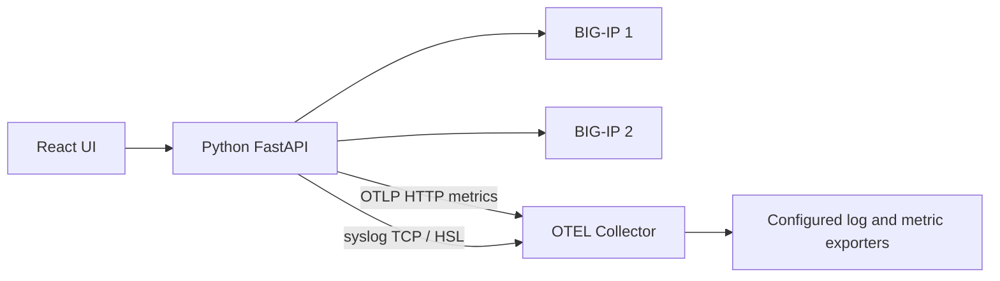
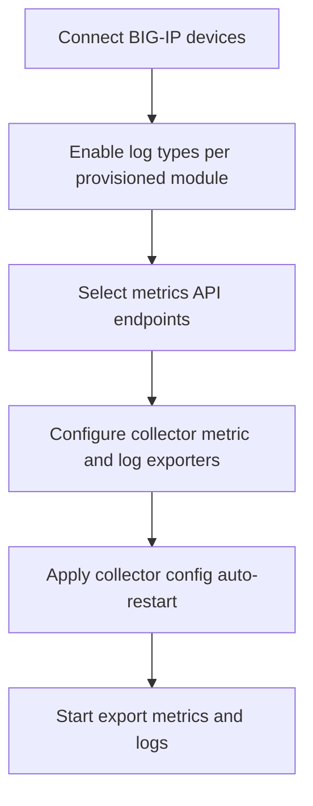
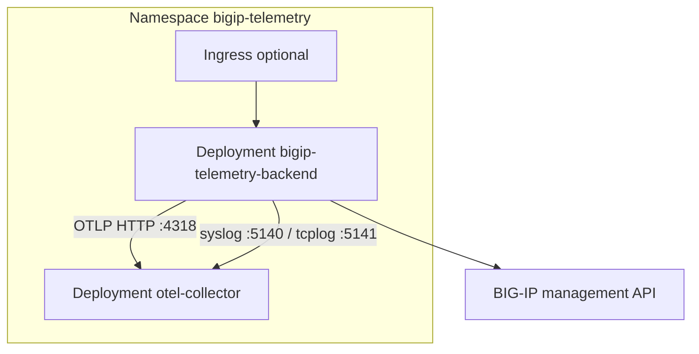

# BIG-IP Telemetry Exporter

Pull **metrics** from F5 BIG-IP iControl REST APIs and forward **logs** from BIG-IP (LTM, ASM, AFM, AVR, and system syslog) to an [OpenTelemetry Collector](https://github.com/open-telemetry/opentelemetry-collector) using separate metric and log pipelines.

The React UI is styled similarly to [BIG-IP-Telemetry-Streaming-Validator-and-Configurator](https://github.com/gregcoward/BIG-IP-Telemetry-Streaming-Configurator): connect to one or more BIG-IPs, choose what to export, configure collector exporters, and start export.


## Table of contents

- [Architecture](#architecture)
- [Authentication Security](#authentication-security)
- [User guide](#user-guide)
  - [UI overview](#ui-overview)
  - [Session persistence across restarts](#session-persistence-across-restarts)
- [Installation options](#installation-options)
- [Install on Ubuntu Linux (without Kubernetes)](#install-on-ubuntu-linux-without-kubernetes)
  - [Prerequisites](#prerequisites)
  - [Step 1 — Clone the repository](#step-1--clone-the-repository)
  - [Step 2 — Start OpenTelemetry Collector](#step-2--start-opentelemetry-collector)
  - [Step 3 — Install and run the Python backend](#step-3--install-and-run-the-python-backend)
  - [Step 4 — Build the web UI (production)](#step-4--build-the-web-ui-production)
  - [Step 5 — Use the application](#step-5--use-the-application)
  - [Optional — Development UI (Vite)](#optional--development-ui-vite)
  - [Optional — Firewall (UFW)](#optional--firewall-ufw)
  - [Ubuntu troubleshooting](#ubuntu-troubleshooting)
- [Install on macOS (without Kubernetes)](#install-on-macos-without-kubernetes)
  - [macOS prerequisites](#macos-prerequisites)
  - [macOS Step 1 — Clone the repository](#macos-step-1--clone-the-repository)
  - [macOS Step 2 — Start OpenTelemetry Collector](#macos-step-2--start-opentelemetry-collector)
  - [macOS Step 3 — Install and run the Python backend](#macos-step-3--install-and-run-the-python-backend)
  - [macOS Step 4 — Build the web UI (production)](#macos-step-4--build-the-web-ui-production)
  - [macOS Step 5 — Use the application](#macos-step-5--use-the-application)
  - [Optional — Development UI (Vite) on macOS](#optional--development-ui-vite-on-macos)
  - [macOS-specific notes](#macos-specific-notes)
  - [macOS troubleshooting](#macos-troubleshooting)
- [Install on Kubernetes](#install-on-kubernetes)
  - [Architecture in the cluster](#architecture-in-the-cluster)
  - [Prerequisites](#kubernetes-prerequisites)
  - [Step 1 — Build the backend image](#step-1--build-the-backend-image)
  - [Step 2 — Deploy the stack](#step-2--deploy-the-stack)
  - [Step 3 — Open the UI](#step-3--open-the-ui)
  - [Step 4 — Use the application](#step-4--use-the-application-on-kubernetes)
  - [Step 5 — Uninstall](#step-5--uninstall)
  - [Manifests and overlays](#manifests-and-overlays)
  - [Kubernetes troubleshooting](#kubernetes-troubleshooting)
- [Access from other machines](#access-from-other-machines)
- [User guide (detailed)](docs/user-guide.md)
- [API catalog](#api-catalog)
- [Collector exporters (UI)](#collector-exporters-ui)
- [Backend environment variables (optional)](#backend-environment-variables-optional)
- [Repository](#repository)
- [License](#license)

## Architecture



| Component | Role |
|-----------|------|
| **Python backend** | Sessions to one or more BIG-IPs; polls selected `/mgmt/.../stats` endpoints; configures remote logging via AS3 and system syslog; pushes OTLP metrics to the collector |
| **OTEL Collector** | Receives OTLP metrics on `:4318`; receives BIG-IP logs on syslog `:5140` (ASM/AFM) and tcplog `:5141` (LTM request logging); forwards via UI-configured exporters |
| **React frontend** | Multi-BIG-IP connect form, per-device log export toggles (provisioned modules only), API catalog, split metric/log collector exporters, export controls |

## Authentication Security

The exporter authenticates to each BIG-IP with **iControl REST** using the credentials you enter in the UI. It does **not** store tokens in the browser and does not implement its own identity provider for the web UI.

### How login works

1. On **Connect**, the browser sends host, username, password, and TLS options to the local backend (`POST /api/connect`) over the same origin as the UI (typically `http://<host>:8001`).
2. The backend opens HTTPS to the BIG-IP and `POSTs to `/mgmt/shared/authn/login` (TMOS login provider).
3. BIG-IP returns an auth token. The backend stores that token only in the in-memory `BigIPClient` session and sends it on later calls as the `X-F5-Auth-Token` header.
4. After login, the backend attempts to **extend** the token lifetime (default login timeout is ~20 minutes; extension targets ~60 minutes when allowed by the platform).
5. Metric polls and AS3 / syslog configuration use that token. On **401**, the client clears any stale token header, logs in again with the stored password, and retries the request.

On **Remove**, the backend deletes the token on the BIG-IP (`DELETE /mgmt/shared/authz/tokens/...`) and drops the local session.

### Encryption used

| Layer | Algorithm / mechanism | What it protects |
|-------|----------------------|------------------|
| **BIG-IP transport** | **TLS** (HTTPS). Cipher suite and TLS version are negotiated by the BIG-IP and the Python `requests` / OpenSSL stack on the host. | Username/password on login and all subsequent iControl REST traffic (including the auth token). |
| **Password at rest** | **Fernet** from the Python [`cryptography`](https://cryptography.io/) package (`cryptography.fernet.Fernet`). Fernet is **symmetric authenticated encryption**: **AES-128 in CBC mode** with a **HMAC-SHA256** integrity check (URL-safe base64 token format). Implemented in `backend/session_store.py`. | Only the password field in `sessions.json`. Host, username, and other session metadata are stored in plaintext JSON. |
| **Encryption key** | A Fernet key (32 url-safe base64-encoded bytes). Auto-generated with `Fernet.generate_key()` into `sessions.key`, or supplied via `BIGIP_SESSION_ENCRYPTION_KEY`. | Required to decrypt stored passwords. Losing the key makes encrypted passwords unrecoverable. |

Fernet does **not** encrypt the entire session file — only each password string. Tokens are **not** written to disk; they exist only in process memory until logout or restart (restart re-logins with the decrypted password).

### What is secured (and what is not)

| Area | Behavior |
|------|----------|
| **Transport to BIG-IP** | Always HTTPS (`https://<host>`). Optional **Verify TLS certificate** in the UI (`verify_tls`); default is off so lab devices with self-signed certs still work. Enable verification in production when the BIG-IP presents a trusted certificate. |
| **Token vs password on the wire** | After the initial login, day-to-day API calls use the token, not the password. Token expiry triggers a fresh login. |
| **Browser** | Passwords are not persisted in localStorage. The UI only holds credentials long enough to POST connect. Device list comes from `GET /api/bigips`. |
| **At-rest session store** | When `BIGIP_SESSION_PERSIST=true` (default), passwords are Fernet-encrypted (AES-128-CBC + HMAC-SHA256) into `~/.config/bigip-telemetry-exporter/sessions.json`. The key is `sessions.key` (mode `0600` when creatable) or `BIGIP_SESSION_ENCRYPTION_KEY`. The JSON file is also chmod `0600` when possible. |
| **Backend process memory** | Decrypted passwords and live tokens remain in the Python process for reconnect and export. Anyone who can read that process memory or ptrace the user running the API can recover them. |
| **Web UI / API surface** | The FastAPI server has **no login**. Anyone who can reach `:8001` can connect BIG-IPs (if they know device credentials) and change export/collector config. Bind and firewall accordingly. |

### Recommendations

- Prefer a **least-privilege** BIG-IP account with iControl REST rights only for the stats and configuration this tool needs — not your personal admin password when avoidable.
- Enable **Verify TLS certificate** when BIG-IP certificates are valid for the management hostname/IP you configure.
- Treat `sessions.json` / `sessions.key` like secrets; use `BIGIP_SESSION_PERSIST=false` on shared jump hosts if you must not keep passwords on disk.
- In containers/Kubernetes, set a stable `BIGIP_SESSION_ENCRYPTION_KEY` (or mounted key file) so restarts can decrypt the store, and restrict who can open the UI port.
- Do not expose port **8001** on untrusted networks without an external auth proxy or VPN.

Related: [Session persistence across restarts](#session-persistence-across-restarts).

## User guide

End-to-end workflow after [installation](#installation-options). Expanded copy: [`docs/user-guide.md`](docs/user-guide.md). Kubernetes networking: [`docs/kubernetes.md`](docs/kubernetes.md).

### Workflow overview



| Step | UI section | Outcome |
|------|------------|---------|
| 1 | **BIG-IP connections** | Authenticate; enable per-device log types (LTM, ASM, AFM, AVR, system) based on provisioned modules |
| 2 | **API endpoints** | Choose which `/mgmt/...` paths to poll for metrics (stats paths recommended) |
| 3 | **OpenTelemetry Collector exporters** | Configure metric and log exporters separately; **Apply collector config** restarts the collector |
| 4 | **Export to collector** | Metrics via OTLP; logs via syslog/tcplog receivers on the collector |

### UI overview

| Area | What it shows |
|------|----------------|
| **Connected status bar** (top, when ≥1 device) | Count, chips, export selection summary, **Refresh list**, auto-refresh every 45 seconds |
| **BIG-IP connections** | Device list with export checkboxes, per-device log toggles (LTM/ASM/AFM/AVR when provisioned), system syslog, **Remove**, connect form |
| **API endpoints** | iControl REST path catalog for metrics |
| **OpenTelemetry Collector exporters** | Separate **metric** and **log** exporter sections; apply restarts collector |
| **Export to collector** | OTLP metrics settings and poll interval |

After `git pull`, rebuild the UI if you serve production assets: `cd frontend && npm ci && npm run build`, then restart the API.

### 1. Connect BIG-IP devices

Open the UI (`http://<HOST-IP>:8001` on Ubuntu or macOS, or port-forward on Kubernetes).

| Field | Notes |
|-------|--------|
| **Management host** | IP or hostname (HTTPS). `https://` is added automatically if omitted. |
| **Label** | Optional friendly name (e.g. `prod-dc1`). Defaults to the host/IP. |
| **Username / Password** | Account with iControl REST access (often `admin`). |
| **Verify TLS** | Uncheck for default self-signed BIG-IP management certificates. |

- **Connect** / **Add BIG-IP** — enabled when host, username, password, and at least one export option (metrics and/or logs) are selected.
- **Connect** — first device.
- **Add BIG-IP** — additional devices without disconnecting others.
- **Remove** — logs out and drops that session (`DELETE /api/session/{id}`).
- Reconnecting the **same host** replaces the previous session for that IP.

On the connect form, choose **Export metrics** and/or **Export logs** (AS3 remote logging profiles). Use per-device toggles after connect for LTM/ASM/AFM/AVR and **System → syslog (:5140)**.

The **BIG-IP connections** card shows the count in its title and lists devices when connected. The top status bar appears only after the first device is connected.

Each connected device appears in a list with:

- A **checkbox** — include or exclude from export (at least one must be checked before **Start export**).
- **Label**, management address, and export mode summary.
- **Logs** row — toggles for **LTM**, **ASM**, **AFM**, **AVR** (only if that module is provisioned on the device).
- **System → syslog (:5140)** — toggle system syslog forwarding to the collector (per device, after connect).
- **Warning** — token extension, AS3, syslog, or provisioning issues.
- **Remove** — disconnect the session.

On connect (and when you change log toggles), the backend:

1. Reads module provisioning (`ltm`, `asm`, `afm`, `avr`).
2. Optionally configures **system syslog** forwarding (`/mgmt/tm/sys/syslog` include → TCP `:5140`).
3. If any module log profile is enabled, verifies **F5 AS3**, then **POST**s an AS3 declaration with logging/analytics objects for provisioned modules only:

| Profile | Default path | Attach on virtual server | Collector port |
|---------|--------------|--------------------------|----------------|
| LTM request-log | `/Common/bigip-telemetry-requestlog` | **Request Logging** | HSL tcplog **5141** |
| ASM security log | `/Common/bigip-telemetry-asm-log` | **Security Log Profile** (Application Security) | syslog **5140** |
| AFM security log | `/Common/bigip-telemetry-afm-log` | **Security Log Profile** (Network Firewall) | syslog **5140** |
| AVR HTTP analytics | `/Common/bigip-telemetry-http-analytics` | HTTP **Analytics** profile | (analytics events) |
| AVR TCP analytics | `/Common/bigip-telemetry-tcp-analytics` | TCP **Analytics** profile | (analytics events) |

Use **`PATCH /api/session/{session_id}/log-options`** to change log types on a connected device without reconnecting.

**Log reachability:** BIG-IP must reach the collector host on **5140** and **5141**. The backend auto-detects a LAN IP for remote log pools; set `BIGIP_LOG_SYSLOG_HOST` if auto-detection fails. Do **not** use `127.0.0.1` — BIG-IP rejects loopback destinations.

### Session persistence across restarts

Connected BIG-IPs and export settings **survive backend restarts** by default. The UI does not store devices locally — on load it calls `GET /api/bigips`, which returns whatever the backend restored from disk.

**On connect or change**, the backend writes an encrypted session file (passwords are Fernet-encrypted, not stored in plain text):

| File | Purpose |
|------|---------|
| `~/.config/bigip-telemetry-exporter/sessions.json` | Device list, encrypted credentials, per-device log/metric options, export config |
| `~/.config/bigip-telemetry-exporter/sessions.key` | Auto-generated encryption key (when `BIGIP_SESSION_ENCRYPTION_KEY` is unset) |

**On backend startup**, the API reloads that file, logs in to each BIG-IP again, and **resumes export** if it was active when the process stopped.

Restarting only the **frontend** (browser refresh or Vite) has no effect on persistence — it simply refetches the restored list from the API.

| Environment variable | Default | Purpose |
|---------------------|---------|---------|
| `BIGIP_SESSION_PERSIST` | `true` | Set `false` for memory-only sessions (lost on backend restart; 45 min TTL while running) |
| `BIGIP_SESSION_STORE_PATH` | `~/.config/bigip-telemetry-exporter/sessions.json` | Custom path for the session + export state file |
| `BIGIP_SESSION_ENCRYPTION_KEY` | _(auto)_ | Fixed Fernet key (useful in containers or to reuse one store across hosts) |
| `BIGIP_SESSION_KEY_FILE` | `{store}.key` | Path for the auto-generated key file |
| `BIGIP_SESSION_TTL_SEC` | `2700` | In-memory session TTL when persistence is disabled |

**Adjusting behavior:**

- **Disable persistence** (fresh start every backend restart):  
  `export BIGIP_SESSION_PERSIST=false` before starting `run_server.py`
- **Clear saved devices** without disabling persistence: stop the backend, delete `sessions.json` (and optionally `.key`), then restart
- **Disconnect one device** in the UI (**Remove**) — removes that session from the store on the next save

Treat the session store like a secrets file: restrict filesystem permissions. On shared admin hosts, set `BIGIP_SESSION_PERSIST=false` if you do not want passwords retained on disk.

**Log profile environment variables:**

| Environment variable | Default | Purpose |
|---------------------|---------|---------|
| `BIGIP_REQUEST_LOG_PROFILE_NAME` | `bigip-telemetry-requestlog` | LTM request-log profile name |
| `BIGIP_ASM_LOG_PROFILE_NAME` | `bigip-telemetry-asm-log` | ASM security log profile name |
| `BIGIP_AFM_LOG_PROFILE_NAME` | `bigip-telemetry-afm-log` | AFM security log profile name |
| `BIGIP_LOG_PROFILE_PARTITION` | `Common` | Partition for all exporter-managed profiles |
| `BIGIP_LOG_SYSLOG_HOST` | Auto-detected LAN IP (or browser host); must be reachable from BIG-IP — not `127.0.0.1` |
| `BIGIP_LOG_SYSLOG_PORT` | `5140` | Collector syslog receiver (ASM/AFM security logs, RFC5424) |
| `BIGIP_LOG_HSL_PORT` | `5141` | Collector tcplog receiver (LTM request/response logs via HSL) |
| `BIGIP_REQUEST_LOG_AUTO_CREATE` | `true` | Set `false` to skip LTM profile on connect |
| `BIGIP_ASM_LOG_AUTO_CREATE` | `true` | Set `false` to skip ASM profile on connect |
| `BIGIP_AFM_LOG_AUTO_CREATE` | `true` | Set `false` to skip AFM profile on connect |
| `BIGIP_AFM_LOG_PUBLISHER` | `/Common/local-db-publisher` | Log publisher for AFM network events |
| `BIGIP_HTTP_ANALYTICS_PROFILE_NAME` | `bigip-telemetry-http-analytics` | AVR HTTP analytics profile name |
| `BIGIP_TCP_ANALYTICS_PROFILE_NAME` | `bigip-telemetry-tcp-analytics` | AVR TCP analytics profile name |
| `BIGIP_HTTP_ANALYTICS_AUTO_CREATE` | `true` | Set `false` to skip HTTP analytics profile |
| `BIGIP_TCP_ANALYTICS_AUTO_CREATE` | `true` | Set `false` to skip TCP analytics profile |
| `BIGIP_AS3_RPM_PATH` | _(unset)_ | Local path to `f5-appsvcs-*.noarch.rpm`; when unset, the latest RPM is downloaded from [F5 AS3 GitHub releases](https://github.com/F5Networks/f5-appsvcs-extension/releases) |
| `BIGIP_AS3_AUTO_INSTALL` | `true` | Set `false` to require AS3 pre-installed |
| `BIGIP_AS3_GITHUB_DOWNLOAD` | `true` | Set `false` to disable GitHub RPM download when `BIGIP_AS3_RPM_PATH` is unset |
| `BIGIP_AS3_RELEASE_VERSION` | `latest` | GitHub release tag (e.g. `v3.56.0`) or `latest` |
| `BIGIP_AS3_DOWNLOAD_CACHE_DIR` | `~/.cache/bigip-telemetry-exporter/as3-rpms` | Cache directory for downloaded AS3 RPMs |
| `BIGIP_AS3_GITHUB_REPO` | `F5Networks/f5-appsvcs-extension` | GitHub repo for AS3 release downloads |
| `BIGIP_AS3_INSTALL_TIMEOUT_SEC` | `600` | Max wait for package-management INSTALL task |
| `BIGIP_AS3_READY_TIMEOUT_SEC` | `180` | Max wait for `/mgmt/shared/appsvcs/info` after install |
| `BIGIP_AS3_READY_POLL_SEC` | `2` | Poll interval while waiting for AS3 `/info` |
| `BIGIP_AS3_RESTART_RESTNODED_AFTER_SEC` | `45` | Restart `restnoded` once if `/info` is still down |
| `BIGIP_AS3_SCHEMA_VERSION` | `3.49.0` | AS3 declaration `schemaVersion` when `/info` is unavailable |

### 2. Select API endpoints

The catalog comes from [`data/bigip_apis.csv`](data/bigip_apis.csv) (103 paths; 38 metrics-oriented by default, including ASM event sources and AFM firewall stats).

| Control | Purpose |
|---------|---------|
| **Metrics / stats endpoints only** | Filters to rows marked `collect_metrics=true` |
| **Module filter** | Filters by the CSV `module` column (e.g. **ASM** for `/mgmt/tm/asm/*`, **AFM** for `/mgmt/tm/security/firewall/*`, **SECURITY** for other `/mgmt/tm/security/*`) |
| **Select all visible / Clear** | Bulk selection |
| Per-row checkbox | Individual `/mgmt/...` paths |

Defaults pre-select stats endpoints. Prefer `.../stats` paths for time-series style counters and gauges.

### 3. Configure collector exporters (optional)

The UI has two sections:

- **Metric exporters** — sinks for OTLP metrics from the Python backend (remote OTLP, file, etc.).
- **Log exporters** — sinks for logs received on syslog `:5140` and tcplog `:5141`.

1. Add or enable exporters in each section (for metrics, add a Prometheus scrape exporter, OTLP remote write, or other sink as needed).
2. Click **Apply collector config** — writes `otel-collector/generated-config.yaml` and **restarts** the OpenTelemetry Collector (Docker Compose or `kubectl` when available).
3. If restart fails, the UI shows a manual command. Set `COLLECTOR_AUTO_RESTART=false` to only write YAML without restarting.

### 4. Start export

| Field | Ubuntu / macOS (default) | Kubernetes |
|-------|--------------------------|--------------|
| **OTLP HTTP endpoint** | `http://127.0.0.1:4318` | Pre-filled: `http://otel-collector.bigip-telemetry.svc.cluster.local:4318` |
| **Poll interval** | Seconds between full poll cycles (default 30) | Same |

**Start export** runs when at least one connected device is checked for export:

- **Metrics** — polls selected `/mgmt/.../stats` endpoints and sends OTLP metrics to the collector.
- **Logs** — traffic from enabled BIG-IP logging profiles and system syslog reaches the collector on ports **5140** / **5141** (if those features were configured on connect).

Export status (and **Refresh status**) shows `running`, device count, `last_point_count`, `last_errors_by_host`, and `poll_interval_sec`.

**Stop export** ends the background loop.

REST equivalent: `POST /api/export/start` with body `{ "session_ids": ["..."], "endpoints": [...], "poll_interval_sec": 30, "otlp_endpoint": "..." }`. Empty `session_ids` exports all connected devices.

### Multi-BIG-IP behavior

| Topic | Behavior |
|-------|----------|
| Sessions | One session per device; list via `GET /api/bigips` |
| Metric identity | OTLP instruments keyed per `bigip.host` so values do not overwrite across devices |
| Metric naming | One OTLP metric name per stat field, e.g. `bigip_tm_ltm_virtual_stats_clientside_bitsin`; device rollups for CPU (`*_device_avg` / `*_device_max`) and memory (`*_host_avg|max`, `*_tmm_avg|max`) |
| Attributes (dimensions) | `bigip_host` (device), `bigip_object` (virtual server, pool slot, CPU core, memory object, etc.); rollups use `bigip_host` only |
| Excluded objects | Metrics whose `bigip_object` contains `fiveminavg`, `fivesecavg`, or `oneminavge` / `oneminavg` are dropped (override: `BIGIP_EXCLUDE_OBJECT_PATTERNS`) |
| Export scope | Only devices checked in the connections list (unless using API with explicit `session_ids`) |
| Network | Each device must be reachable from the host/pod running the Python backend |

### REST API summary

| Method | Path | Purpose |
|--------|------|---------|
| `GET` | `/api/health` | Liveness |
| `GET` | `/api/bigips` | List connected devices |
| `POST` | `/api/connect` | Add or replace device session |
| `DELETE` | `/api/session/{session_id}` | Disconnect device |
| `GET` | `/api/apis` | API catalog |
| `POST` | `/api/export/start` | Start multi-device export |
| `POST` | `/api/export/stop` | Stop export |
| `GET` | `/api/export/status` | Loop status + connected devices |
| `PATCH` | `/api/session/{session_id}/log-options` | Update log export toggles on a connected device |
| `POST` | `/api/session/{session_id}/rollback` | Remove exporter log profiles and system syslog on BIG-IP |
| `GET` | `/api/exporters/catalog` | Collector contrib exporter types and form fields |
| `GET` | `/api/collector/control` | Collector restart mode and hints |
| `GET` / `POST` | `/api/collector/config` | Read/write collector YAML (POST restarts collector when enabled) |

### Common issues (user-facing)

| Symptom | What to do |
|---------|------------|
| Cannot connect | Ping/curl management IP from the API host/pod; try **Verify TLS** off |
| `401 Authentication failed` | Check user/password and REST permissions |
| Token extension warning | Reconnect before long runs, or ignore if export is under ~20 min |
| AS3 / profile errors | Use **admin** account for AS3 install; allow up to 180s for `/info`; check `BIGIP_AS3_RPM_PATH`, provisioning, and `BIGIP_LOG_SYSLOG_HOST` (not loopback) |
| No metrics at downstream sink | Export running? Devices checked for metrics? Collector up? OTLP URL correct? Metric exporters configured? |
| Only one device in metrics | Confirm multiple devices checked; use `bigip_host` in PromQL |
| Log options missing | Module not provisioned on BIG-IP (LTM/ASM/AFM/AVR toggles hidden) |
| `{"detail":"Not Found"}` on `/` | Build UI: `cd frontend && npm ci && npm run build`, restart API |

## Installation options

| Method | Best for |
|--------|----------|
| **[Ubuntu Linux](#install-on-ubuntu-linux-without-kubernetes)** | Single VM or bare-metal host, Docker for collector, Python for API + UI |
| **[macOS](#install-on-macos-without-kubernetes)** | Local development or a Mac workstation, Docker Desktop for collector, Python for API + UI |
| **[Kubernetes](#install-on-kubernetes)** | Clusters (EKS, GKE, OpenShift, kind, etc.) |

All methods run the same components; only packaging and networking differ.

---

## Install on Ubuntu Linux (without Kubernetes)

These steps target **Ubuntu 22.04 or 24.04 LTS** on a host that can reach your BIG-IP management IP (HTTPS, typically port **443**).

### Prerequisites

Install system packages, Docker, and Node.js (Node is only required to build the UI).

```bash
sudo apt-get update
sudo apt-get install -y git curl ca-certificates python3 python3-venv python3-pip

# Docker Engine + Compose plugin (official convenience script)
curl -fsSL https://get.docker.com | sudo sh
sudo usermod -aG docker "$USER"
# Log out and back in so the docker group applies, then:
docker compose version

# Node.js 20.x (for building the React UI)
curl -fsSL https://deb.nodesource.com/setup_20.x | sudo -E bash -
sudo apt-get install -y nodejs
node --version
npm --version
```

Confirm the host can reach BIG-IP (replace with your management IP):

```bash
curl -sk --connect-timeout 5 https://<BIG-IP-MGMT-IP>/mgmt/shared/ident | head -c 200
```

### Step 1 — Clone the repository

```bash
cd ~
git clone https://github.com/gregcoward/BIG-IP-Telemetry-Exporter.git
cd BIG-IP-Telemetry-Exporter
chmod +x scripts/*.sh
```

### Step 2 — Start OpenTelemetry Collector

```bash
./scripts/init-collector-config.sh
docker compose up -d
docker compose ps
```

Verify the collector is running:

| Service | Port | Purpose |
|---------|------|---------|
| `otel-collector` | 4318 | OTLP HTTP (backend sends metrics here) |
| `otel-collector` | 8889 | Prometheus scrape endpoint (default when no metric exporters configured) |
| `prometheus` | 9090 | Prometheus UI (scrapes collector :8889) |
| `otel-collector` | 5140 | Syslog receiver (ASM/AFM security logs, system syslog) |
| `otel-collector` | 5141 | tcplog receiver (LTM request/response logs via HSL) |
| `otel-collector` | 13133 | Health check |

```bash
curl -s "http://127.0.0.1:13133/"
```

### Step 3 — Install and run the Python backend

```bash
cd ~/BIG-IP-Telemetry-Exporter
python3 -m venv .venv
source .venv/bin/activate
pip install --upgrade pip
pip install -r requirements.txt
```

Run the API (listens on **all interfaces**, port **8001** by default — avoids conflict with other services on 8000):

```bash
source .venv/bin/activate
python run_server.py
# Default port 8001. Override: PORT=8002 python run_server.py
```

> **Note:** The Docker/Kubernetes image sets `PORT=8000` inside the container (service port 8000). Local `run_server.py` defaults to **8001** unless `PORT` is set.

Leave this terminal open, or run in the background:

```bash
nohup .venv/bin/python run_server.py > /tmp/bigip-telemetry-api.log 2>&1 &
curl -s http://127.0.0.1:8001/api/health
```

### Step 4 — Build the web UI (required for the web page)

The UI is **not** in git — you must build it once. In a **new terminal**:

```bash
cd ~/BIG-IP-Telemetry-Exporter/frontend
npm ci
npm run build
ls -la dist/index.html   # must exist
```

The backend serves files from `frontend/dist`. Restart `run_server.py` if it was already running.

If you open the app **before** building, you will see `{"detail":"Not Found"}` or a setup hint page instead of the UI.

Open the application:

```bash
export HOST_IP="$(./scripts/host-ip.sh)"
echo "UI: http://${HOST_IP}:8001"
```

### Step 5 — Use the application

Follow the **[User guide](#user-guide)**. Quick checklist:

1. Open **`http://<HOST-IP>:8001`**.
2. **BIG-IP connections** — connect with **Export metrics** and/or **Export logs**; use per-device toggles for LTM/ASM/AFM/AVR and system syslog.
3. **API endpoints** — select stats paths (defaults are pre-selected).
4. **Collector exporters** (optional) → **Apply collector config** (auto-restarts collector).
5. **Export** — OTLP `http://127.0.0.1:4318` → **Start export**.

For log export, ensure BIG-IP can reach this host on **5140** and **5141**. Set `BIGIP_LOG_SYSLOG_HOST` if auto-detection picks the wrong address.

### Optional — Development UI (Vite)

Use this if you are changing the React code (hot reload). Requires the backend from Step 3.

```bash
cd ~/BIG-IP-Telemetry-Exporter/frontend
npm run dev
```

Open **`http://<HOST-IP>:5173`** (proxies `/api` to port 8001).

### Optional — Firewall (UFW)

If UFW is enabled, allow the ports you need:

```bash
sudo ufw allow 8001/tcp comment 'BIG-IP Telemetry UI/API'
# Required for BIG-IP remote logging when exporting logs:
sudo ufw allow 5140/tcp comment 'OTEL syslog receiver'
sudo ufw allow 5141/tcp comment 'OTEL HSL tcplog receiver'
```

### Ubuntu troubleshooting

| Symptom | What to check |
|---------|----------------|
| `Cannot reach BIG-IP` | Routing/firewall from Ubuntu host to management IP; `curl -sk https://<IP>/mgmt/shared/ident` |
| `401 Authentication failed` | Username/password; account not locked; user has iControl REST permission |
| `Login failed` / TLS errors | Try with **Verify TLS** unchecked, or install the BIG-IP management CA on Ubuntu |
| `Token extension failed` | Warning only — connection can still work (~20 min token); fix token PATCH if needed |
| No metrics at downstream sink | Export started? Devices checked for metrics? Metric exporters configured? `docker compose logs otel-collector`; OTLP `http://127.0.0.1:4318` |
| No logs in collector | BIG-IP can reach host on 5140/5141? `BIGIP_LOG_SYSLOG_HOST` not loopback? Profiles attached on virtual servers? |
| Multiple devices, one host in queries | Use `bigip_host` label in PromQL; confirm all devices were checked before export |
| `{"detail":"Not Found"}` on `/` | Run Step 4: `cd frontend && npm ci && npm run build`, restart API |
| UI blank after build | `frontend/dist` exists; restart `python run_server.py` |
| `docker compose` not found | Install compose plugin: `sudo apt-get install docker-compose-plugin` |

Stop the stack:

```bash
docker compose down
# stop API: kill the run_server.py process or Ctrl+C
```

---

## Install on macOS (without Kubernetes)

These steps target **macOS** (Apple Silicon or Intel) on a host that can reach your BIG-IP management IP (HTTPS, typically port **443**). The workflow matches [Ubuntu](#install-on-ubuntu-linux-without-kubernetes): Docker Compose runs the collector and Prometheus; Python serves the API and UI.

### macOS prerequisites

Install [Homebrew](https://brew.sh/) if you do not already have it, then install Git, Python, Node.js, and Docker Desktop.

```bash
# Homebrew (if needed)
/bin/bash -c "$(curl -fsSL https://raw.githubusercontent.com/Homebrew/install/HEAD/install.sh)"

# Git, Python 3, Node.js 20 (for building the React UI)
brew install git python@3 node@20

# Docker Desktop (includes the docker compose plugin)
brew install --cask docker
```

Open **Docker Desktop** from Applications and wait until it reports **Docker is running**. Confirm:

```bash
docker compose version
python3 --version
node --version
npm --version
```

Confirm the Mac can reach BIG-IP (replace with your management IP):

```bash
curl -sk --connect-timeout 5 https://<BIG-IP-MGMT-IP>/mgmt/shared/ident | head -c 200
```

### macOS Step 1 — Clone the repository

```bash
cd ~
git clone https://github.com/gregcoward/BIG-IP-Telemetry-Exporter.git
cd BIG-IP-Telemetry-Exporter
chmod +x scripts/*.sh
```

### macOS Step 2 — Start OpenTelemetry Collector

```bash
./scripts/init-collector-config.sh
docker compose up -d
docker compose ps
```

Verify the collector is running:

| Service | Port | Purpose |
|---------|------|---------|
| `otel-collector` | 4318 | OTLP HTTP (backend sends metrics here) |
| `otel-collector` | 8889 | Prometheus scrape endpoint (default when no metric exporters configured) |
| `prometheus` | 9090 | Prometheus UI (scrapes collector :8889) |
| `otel-collector` | 5140 | Syslog receiver (ASM/AFM security logs, system syslog) |
| `otel-collector` | 5141 | tcplog receiver (LTM request/response logs via HSL) |
| `otel-collector` | 13133 | Health check |

```bash
curl -s "http://127.0.0.1:13133/"
```

### macOS Step 3 — Install and run the Python backend

```bash
cd ~/BIG-IP-Telemetry-Exporter
python3 -m venv .venv
source .venv/bin/activate
pip install --upgrade pip
pip install -r requirements.txt
```

Run the API (listens on **all interfaces**, port **8001** by default):

```bash
source .venv/bin/activate
python run_server.py
# Default port 8001. Override: PORT=8002 python run_server.py
```

> **Note:** The Docker/Kubernetes image sets `PORT=8000` inside the container (service port 8000). Local `run_server.py` defaults to **8001** unless `PORT` is set.

Leave this terminal open, or run in the background:

```bash
nohup .venv/bin/python run_server.py > /tmp/bigip-telemetry-api.log 2>&1 &
curl -s http://127.0.0.1:8001/api/health
```

### macOS Step 4 — Build the web UI (production)

The UI is **not** in git — you must build it once. In a **new terminal**:

```bash
cd ~/BIG-IP-Telemetry-Exporter/frontend
npm ci
npm run build
ls -la dist/index.html   # must exist
```

The backend serves files from `frontend/dist`. Restart `run_server.py` if it was already running.

If you open the app **before** building, you will see `{"detail":"Not Found"}` or a setup hint page instead of the UI.

Open the application:

```bash
export HOST_IP="$(./scripts/host-ip.sh)"
echo "UI: http://${HOST_IP}:8001"
```

### macOS Step 5 — Use the application

Follow the **[User guide](#user-guide)**. Quick checklist:

1. Open **`http://<HOST-IP>:8001`** (use your Mac’s LAN IP from `scripts/host-ip.sh`, not only `localhost`, if opening from another machine).
2. **BIG-IP connections** — connect with **Export metrics** and/or **Export logs**; use per-device toggles for LTM/ASM/AFM/AVR and system syslog.
3. **API endpoints** — select stats paths (defaults are pre-selected).
4. **Collector exporters** (optional) → **Apply collector config** (auto-restarts collector).
5. **Export** — OTLP `http://127.0.0.1:4318` → **Start export**.

For log export, ensure BIG-IP can reach this Mac on **5140** and **5141**. Set `BIGIP_LOG_SYSLOG_HOST` if auto-detection picks the wrong address (see [macOS-specific notes](#macos-specific-notes)).

### Optional — Development UI (Vite) on macOS

Use this if you are changing the React code (hot reload). Requires the backend from Step 3.

```bash
cd ~/BIG-IP-Telemetry-Exporter/frontend
npm run dev
```

Open **`http://<HOST-IP>:5173`** (proxies `/api` to port 8001).

### macOS-specific notes

| Topic | Guidance |
|-------|----------|
| **Docker Desktop** | Must be running before `docker compose up`. On first launch, allow the VM/network permissions macOS prompts for. |
| **Host IP for BIG-IP log forwarding** | BIG-IP must reach your Mac on **5140** and **5141**. Do **not** use `127.0.0.1` or `localhost` — BIG-IP rejects loopback destinations. The backend auto-detects a LAN IP; override with `export BIGIP_LOG_SYSLOG_HOST="$(./scripts/host-ip.sh)"` before starting `run_server.py` if needed. |
| **`scripts/host-ip.sh`** | Prints a reachable LAN address (`en0` / `en1` on macOS). Override: `export HOST_IP=192.168.1.10`. |
| **Ports** | **8001** UI/API, **4318** OTLP, **8889** collector Prometheus scrape, **9090** Prometheus UI, **5140** syslog, **5141** HSL tcplog. Ensure nothing else binds these ports and that macOS firewall (if enabled) allows inbound **5140** / **5141** from BIG-IP. |
| **BIG-IP on another network** | If BIG-IP cannot route to your Mac’s LAN IP, use a reachable host IP or VPN address and set `BIGIP_LOG_SYSLOG_HOST` explicitly. |

### macOS troubleshooting

| Symptom | What to check |
|---------|----------------|
| `Cannot reach BIG-IP` | Routing/firewall from Mac to management IP; `curl -sk https://<IP>/mgmt/shared/ident` |
| `docker compose` fails / daemon not running | Start **Docker Desktop**; wait until the whale icon is steady |
| `401 Authentication failed` | Username/password; account not locked; user has iControl REST permission |
| `Login failed` / TLS errors | Try with **Verify TLS** unchecked |
| No metrics at downstream sink | Export started? Devices checked for metrics? Metric exporters configured? `docker compose logs otel-collector`; OTLP `http://127.0.0.1:4318` |
| No logs in collector | BIG-IP can reach Mac on 5140/5141? `BIGIP_LOG_SYSLOG_HOST` not loopback? Profiles attached on virtual servers? |
| `{"detail":"Not Found"}` on `/` | Run Step 4: `cd frontend && npm ci && npm run build`, restart API |
| UI blank after build | `frontend/dist` exists; restart `python run_server.py` |
| Wrong IP in log pools | `export BIGIP_LOG_SYSLOG_HOST="$(./scripts/host-ip.sh)"` and restart API |

Stop the stack:

```bash
docker compose down
# stop API: kill the run_server.py process or Ctrl+C
```

---

## Install on Kubernetes

Deploy the **full application** (backend + UI and OpenTelemetry Collector) with manifests under [`k8s/`](k8s/) and [Kustomize](https://kustomize.io/).

Detailed guide: **[`docs/kubernetes.md`](docs/kubernetes.md)**

### Architecture in the cluster



| Workload | Image | Service |
|----------|-------|---------|
| Backend + UI | `bigip-telemetry-exporter` (built from [`Dockerfile`](Dockerfile)) | `bigip-telemetry-backend:8000` |
| OTEL Collector | `otel/opentelemetry-collector-contrib:0.109.0` | `otel-collector:4317/4318` |

### Kubernetes prerequisites

- Kubernetes **1.25+** and `kubectl`
- **Docker** on your workstation to build the backend image
- Cluster nodes (or pod network) can reach BIG-IP management IP(s) on HTTPS
- The backend image is **not** on Docker Hub — you must build and load/push it (see below)

### Step 1 — Build the backend image

```bash
git clone https://github.com/gregcoward/BIG-IP-Telemetry-Exporter.git
cd BIG-IP-Telemetry-Exporter
chmod +x scripts/k8s-*.sh   # build, deploy, apply-collector-config, uninstall
./scripts/k8s-build-image.sh
```

**Local cluster** (kind / minikube / k3d):

```bash
./scripts/k8s-load-image.sh
```

**Remote cluster** (registry):

```bash
export IMAGE=ghcr.io/<you>/bigip-telemetry-exporter:1.0.0
docker tag bigip-telemetry-exporter:latest "${IMAGE}"
docker push "${IMAGE}"
```

### Step 2 — Deploy the stack

**Local image** (no registry):

```bash
./scripts/k8s-deploy.sh local
```

**Registry image**:

```bash
IMAGE="${IMAGE}" ./scripts/k8s-deploy.sh minimal
```

Wait for pods:

```bash
kubectl -n bigip-telemetry get pods
```

### Step 3 — Open the UI

Bind port-forwards on all interfaces so other machines can use your host IP:

```bash
export HOST_IP="$(./scripts/host-ip.sh)"

kubectl -n bigip-telemetry port-forward --address 0.0.0.0 svc/bigip-telemetry-backend 8001:8000
# UI: http://<HOST-IP>:8001
```

### Step 4 — Use the application on Kubernetes

Follow the **[User guide](#user-guide)**. Kubernetes-specific checklist:

1. Open **`http://<HOST-IP>:8001`** (port-forward `8001:8000`).
2. Connect with **Export metrics** and/or log options; use per-device LTM/ASM/AFM/AVR and system syslog toggles.
3. Select APIs; configure **metric** and **log** collector exporters → **Apply collector config** (auto-restarts collector, or run `./scripts/k8s-apply-collector-config.sh`).
4. **Start export** — OTLP endpoint should remain the in-cluster URL (`http://otel-collector.bigip-telemetry.svc.cluster.local:4318`).
5. For log export, ensure BIG-IP can reach collector **5140** / **5141**; set `BIGIP_LOG_SYSLOG_HOST` on the backend if needed.

### Step 5 — Uninstall

Use the **same overlay** you deployed with (`local`, `minimal`, or `example`):

```bash
./scripts/k8s-uninstall.sh local
```

Skip the confirmation prompt:

```bash
./scripts/k8s-uninstall.sh local -y
```

Remove workloads but keep the namespace (for redeploy later):

```bash
./scripts/k8s-uninstall.sh local --keep-namespace
```

Manual equivalent (deletes namespace and all resources):

```bash
kubectl delete -k k8s/overlays/local --wait
```

After uninstall:

- Stop any `kubectl port-forward` sessions still running.
- Optionally remove the local Docker image: `docker rmi bigip-telemetry-exporter:latest`

### Manifests and overlays

| Path | Description |
|------|-------------|
| [`k8s/base/`](k8s/base/) | Namespace, ConfigMaps, Deployments, Services, sample Ingress |
| [`k8s/overlays/local/`](k8s/overlays/local/) | Local image (`imagePullPolicy: Never`) |
| [`k8s/overlays/minimal/`](k8s/overlays/minimal/) | No Ingress; requires `IMAGE=<registry>/...` |
| [`k8s/overlays/example/`](k8s/overlays/example/) | Example registry + Ingress hostnames |

Do not deploy `minimal` without pushing an image — `bigip-telemetry-exporter:latest` is not published to `docker.io`.

### Kubernetes troubleshooting

| Symptom | What to check |
|---------|----------------|
| `ErrImagePull` / `authorization failed` | Image not on Docker Hub — use [`local` overlay](#step-2--deploy-the-stack) or push to your registry |
| `401` / connect errors in UI | Pod network → BIG-IP management IP; TLS verify setting |
| No metrics at downstream sink | Export started? Devices checked for metrics? Metric exporters configured? `kubectl logs -n bigip-telemetry deploy/otel-collector` |
| No logs in collector | BIG-IP → collector on 5140/5141? `BIGIP_LOG_SYSLOG_HOST`? Log exporters configured? |
| Backend pod not ready | Probes hit port 8000 — image must set `PORT=8000` (included in `Dockerfile`) |
| Port-forward only on localhost | Add `--address 0.0.0.0` (see Step 3) |

---

## Access from other machines

Services listen on **`0.0.0.0`**. Use the host’s LAN IP instead of `127.0.0.1` when opening the UI from another workstation.

```bash
export HOST_IP="$(./scripts/host-ip.sh)"   # e.g. 192.168.1.10
```

| Surface | Ubuntu / macOS (default) | Kubernetes (port-forward) |
|---------|--------------------------|---------------------------|
| UI + API | `http://<HOST-IP>:8001` | `http://<HOST-IP>:8001` (port-forward → pod :8000) |
| Vite dev UI | `http://<HOST-IP>:5173` | — |

## API catalog

Endpoints are defined in [`data/bigip_apis.csv`](data/bigip_apis.csv) (103 iControl REST paths; 38 stats/metrics-oriented by default).

## Collector exporters (UI)

The UI configures exporters from the [OpenTelemetry Collector Contrib](https://github.com/open-telemetry/opentelemetry-collector-contrib/tree/main/exporter) distribution (image: `otel/opentelemetry-collector-contrib`).

| Category | Examples |
|----------|----------|
| **Core** | OTLP HTTP/gRPC, debug, file, OTel Arrow |
| **Observability** | Datadog, Splunk HEC, SignalFx, Coralogix, Logz.io, Sumo Logic, Mezmo, Sematext, LogicMonitor |
| **Cloud** | Google Cloud, Google Managed Prometheus, AWS S3, AWS EMF, Azure Monitor |
| **Storage** | Elasticsearch, InfluxDB, OpenSearch, ClickHouse, Cassandra |
| **Messaging** | Kafka, Pulsar, RabbitMQ, syslog |
| **Advanced** | **Contrib exporter (custom YAML)** — any other contrib component; paste settings from upstream docs |

After **Apply collector config**, the API restarts the collector when docker or kubectl is available. Set `COLLECTOR_AUTO_RESTART=false` to disable.

- **Ubuntu / macOS (manual fallback):** `docker compose restart otel-collector`
- **Kubernetes:** `./scripts/k8s-apply-collector-config.sh`

Generated config file: `otel-collector/generated-config.yaml`

Catalog API: `GET /api/exporters/catalog` (categories, field schemas, links to [contrib exporter docs](https://github.com/open-telemetry/opentelemetry-collector-contrib/tree/main/exporter)).

## Backend environment variables (optional)

| Variable | Default | Purpose |
|----------|---------|---------|
| `BIGIP_EXCLUDE_OBJECT_PATTERNS` | `fiveminavg,fivesecavg,oneminavge,oneminavg` | Comma-separated substrings; if `bigip_object` contains any, the metric is skipped |
| `PORT` | `8001` (local), `8000` (Docker/K8s image) | API listen port |
| `OTLP_HTTP_ENDPOINT` | `http://127.0.0.1:4318` | Default OTLP URL in UI (K8s manifest overrides) |
| `COLLECTOR_AUTO_RESTART` | `true` | Set `false` to write config without restarting the collector |
| `COLLECTOR_RESTART_CMD` | _(unset)_ | Custom restart command (overrides auto-detect) |
| `COLLECTOR_RESTART_MODE` | auto | `docker`, `kubernetes`, or `none` |
| `COLLECTOR_HEALTH_URL` | `http://127.0.0.1:13133` | Health check after restart |
| `COLLECTOR_CONFIG_PATH` | `otel-collector/generated-config.yaml` | Path written by **Apply collector config** |

## Repository

https://github.com/gregcoward/BIG-IP-Telemetry-Exporter

## License

Apache 2.0 — see [LICENSE](LICENSE).
