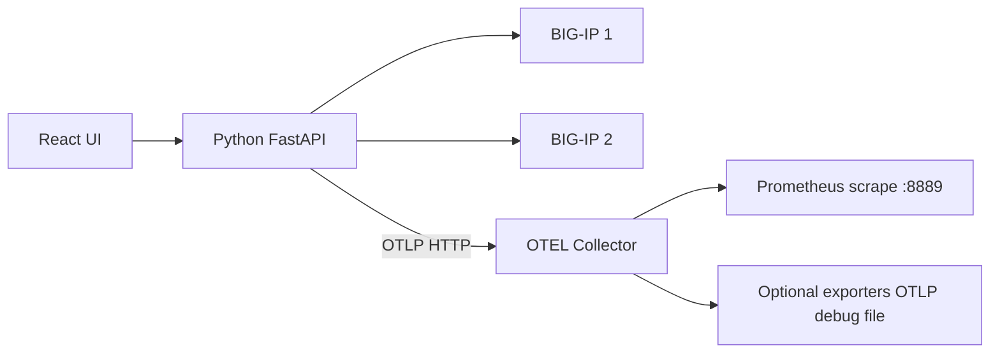
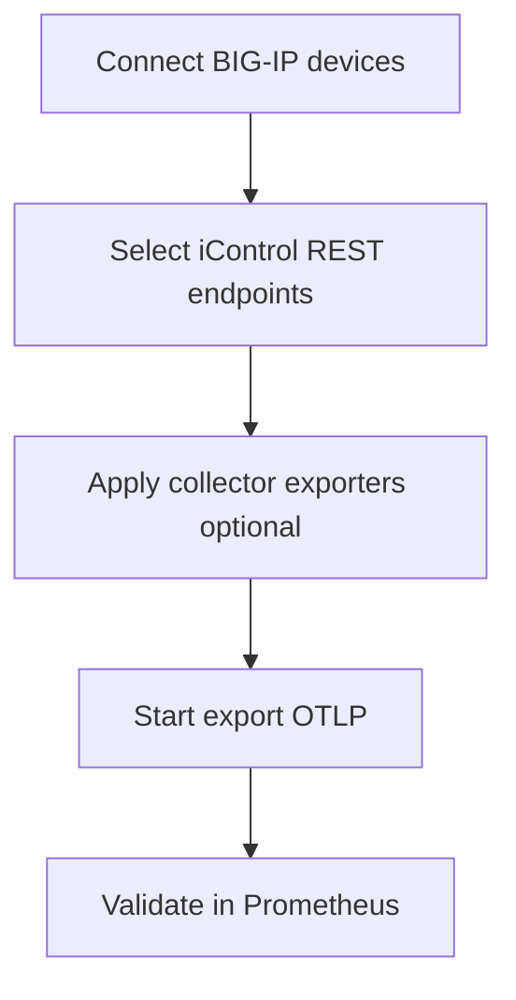
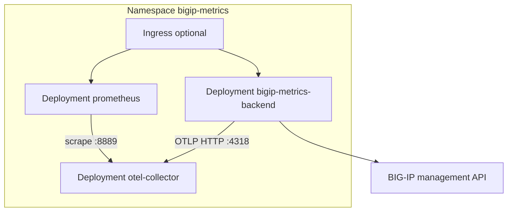

# BIG-IP Metrics Exporter

Pull metrics from F5 BIG-IP iControl REST APIs, export them via **OTLP** to an [OpenTelemetry Collector](https://github.com/open-telemetry/opentelemetry-collector), and validate receipt with a local **Prometheus** instance.

The React UI is styled similarly to [BIG-IP-Telemetry-Streaming-Validator-and-Configurator](https://github.com/gregcoward/BIG-IP-Telemetry-Streaming-Validator-and-Configurator): connect to one or more BIG-IPs, select APIs, configure collector exporters, and run export.

## Table of contents

- [Architecture](#architecture)
- [User guide](#user-guide)
- [Installation options](#installation-options)
- [Install on Ubuntu Linux (without Kubernetes)](#install-on-ubuntu-linux-without-kubernetes)
  - [Prerequisites](#prerequisites)
  - [Step 1 — Clone the repository](#step-1--clone-the-repository)
  - [Step 2 — Start OpenTelemetry Collector and Prometheus](#step-2--start-opentelemetry-collector-and-prometheus)
  - [Step 3 — Install and run the Python backend](#step-3--install-and-run-the-python-backend)
  - [Step 4 — Build the web UI (production)](#step-4--build-the-web-ui-production)
  - [Step 5 — Use the application](#step-5--use-the-application)
  - [Optional — Development UI (Vite)](#optional--development-ui-vite)
  - [Optional — Firewall (UFW)](#optional--firewall-ufw)
  - [Ubuntu troubleshooting](#ubuntu-troubleshooting)
- [Install on Kubernetes](#install-on-kubernetes)
  - [Architecture in the cluster](#architecture-in-the-cluster)
  - [Prerequisites](#kubernetes-prerequisites)
  - [Step 1 — Build the backend image](#step-1--build-the-backend-image)
  - [Step 2 — Deploy the stack](#step-2--deploy-the-stack)
  - [Step 3 — Open the UI and Prometheus](#step-3--open-the-ui-and-prometheus)
  - [Step 4 — Use the application](#step-4--use-the-application-on-kubernetes)
  - [Step 5 — Uninstall](#step-5--uninstall)
  - [Manifests and overlays](#manifests-and-overlays)
  - [Kubernetes troubleshooting](#kubernetes-troubleshooting)
- [Access from other machines](#access-from-other-machines)
- [User guide (detailed)](docs/user-guide.md)
- [API catalog](#api-catalog)
- [Collector exporters (UI)](#collector-exporters-ui)
- [Repository](#repository)
- [License](#license)

## Architecture



| Component | Role |
|-----------|------|
| **Python backend** | Authenticates to one or more BIG-IPs, polls selected `/mgmt/...` endpoints per device, converts nested stats to metric points tagged with `bigip.host`, pushes OTLP HTTP to the collector |
| **OTEL Collector** | Receives OTLP; processes with batch/memory_limiter; exposes Prometheus exporter on `:8889` plus any UI-configured exporters |
| **Prometheus** | Scrapes `otel-collector:8889` to confirm metrics flowed through the collector |
| **React frontend** | Multi-device connections, API catalog, exporter configuration, export control |

## User guide

End-to-end workflow after [installation](#installation-options). Expanded copy: [`docs/user-guide.md`](docs/user-guide.md). Kubernetes networking: [`docs/kubernetes.md`](docs/kubernetes.md).

### Workflow overview



| Step | UI section | Outcome |
|------|------------|---------|
| 1 | **BIG-IP connections** | One or more authenticated sessions to management IPs |
| 2 | **API endpoints** | Choose which `/mgmt/...` paths to poll (stats paths recommended) |
| 3 | **OpenTelemetry Collector exporters** | Optional extra sinks (remote OTLP, file, debug) |
| 4 | **Export to collector** | Periodic poll → OTLP HTTP → collector → Prometheus scrape |
| 5 | **Prometheus validation** | Confirm targets up and query metrics |

### 1. Connect BIG-IP devices

Open the UI (`http://<HOST-IP>:8001` on Ubuntu, or port-forward on Kubernetes).

| Field | Notes |
|-------|--------|
| **Management host** | IP or hostname (HTTPS). `https://` is added automatically if omitted. |
| **Label** | Optional friendly name (e.g. `prod-dc1`). Defaults to the host/IP. |
| **Username / Password** | Account with iControl REST access (often `admin`). |
| **Verify TLS** | Uncheck for default self-signed BIG-IP management certificates. |

- **Connect** — first device.
- **Add BIG-IP** — additional devices without disconnecting others.
- **Remove** — logs out and drops that session (`DELETE /api/session/{id}`).
- Reconnecting the **same host** replaces the previous session for that IP.

Each connected device appears in a list with:

- A **checkbox** — include or exclude from export (at least one must be checked before **Start export**).
- **Label** and management address.
- A **warning** if token extension failed (export may still work for ~20 minutes).

Credentials stay in the API process memory (not written to disk by default). Restarting the backend clears all sessions.

### 2. Select API endpoints

The catalog comes from [`data/bigip_apis.csv`](data/bigip_apis.csv) (84 paths; 33 metrics-oriented by default).

| Control | Purpose |
|---------|---------|
| **Metrics / stats endpoints only** | Filters to rows marked `collect_metrics=true` |
| **Module filter** | LTM, ASM, DNS, etc. |
| **Select all visible / Clear** | Bulk selection |
| Per-row checkbox | Individual `/mgmt/...` paths |

Defaults pre-select stats endpoints. Prefer `.../stats` paths for time-series style counters and gauges.

### 3. Configure collector exporters (optional)

Use **OpenTelemetry Collector exporters** to add sinks beyond the built-in Prometheus exporter on port **8889** (always used for local validation).

1. Add or enable exporters (`otlp_http`, `otlp_grpc`, `debug`, `file`, etc.).
2. **Apply collector config** — writes `otel-collector/generated-config.yaml`.
3. Restart the collector so it picks up the file:

   | Environment | Command |
   |-------------|---------|
   | Ubuntu + Docker | `docker compose restart otel-collector` |
   | Kubernetes | `./scripts/k8s-apply-collector-config.sh` (with backend port-forward active) |

### 4. Start export

| Field | Ubuntu (default) | Kubernetes |
|-------|------------------|--------------|
| **OTLP HTTP endpoint** | `http://127.0.0.1:4318` | Pre-filled: `http://otel-collector.bigip-metrics.svc.cluster.local:4318` |
| **Poll interval** | Seconds between full poll cycles (default 30) | Same |

**Start export** polls every **checked** device × every selected endpoint, converts nested iControl stats to metric points, and pushes OTLP HTTP to the collector.

Export status (and **Refresh status**) shows:

- `running`, `bigip_count`, `bigip_hosts`
- `last_point_count`, `last_errors_by_host` (per-device errors)
- `poll_interval_sec`

**Stop export** ends the background loop.

REST equivalent: `POST /api/export/start` with body `{ "session_ids": ["..."], "endpoints": [...], "poll_interval_sec": 30, "otlp_endpoint": "..." }`. Empty `session_ids` exports all connected devices.

### 5. Validate in Prometheus

| Link | Default URL |
|------|-------------|
| Prometheus UI | `http://<HOST-IP>:9090` |
| Collector Prometheus exporter | `http://<HOST-IP>:8889/metrics` |

1. **Status → Targets** — job `otel-collector` should be **UP**.
2. Query examples:

   ```promql
   bigip_tm_ltm_virtual_stats
   ```

   With multiple BIG-IPs, filter by device label (from metric attributes):

   ```promql
   bigip_tm_ltm_virtual_stats{bigip_host="172.16.60.123"}
   ```

   (Exact label names depend on the collector Prometheus exporter; search `bigip_` in the UI or use **Graph** autocomplete.)

3. **Reload Prometheus** — refresh scrape config (`--web.enable-lifecycle` is enabled in `docker-compose.yml`).
4. **Restart Prometheus** — full container/pod recycle when reload is not enough.

On Ubuntu, restart uses `docker compose restart prometheus`. On Kubernetes, the API runs `kubectl rollout restart deployment/prometheus` in namespace `bigip-metrics`.

### Multi-BIG-IP behavior

| Topic | Behavior |
|-------|----------|
| Sessions | One session per device; list via `GET /api/bigips` |
| Metric identity | OTLP instruments keyed per `bigip.host` so values do not overwrite across devices |
| Attributes | `bigip.host`, `bigip.management_ip`, `bigip.endpoint` on exported points |
| Export scope | Only devices checked in the connections list (unless using API with explicit `session_ids`) |
| Network | Each device must be reachable from the host/pod running the Python backend |

### REST API summary

| Method | Path | Purpose |
|--------|------|---------|
| `GET` | `/api/health` | Liveness |
| `GET` | `/api/bigips` | List connected devices |
| `POST` | `/api/connect` | Add or replace device session |
| `DELETE` | `/api/session/{session_id}` | Disconnect device |
| `GET` | `/api/apis` | API catalog |
| `POST` | `/api/export/start` | Start multi-device export |
| `POST` | `/api/export/stop` | Stop export |
| `GET` | `/api/export/status` | Loop status + connected devices |
| `GET` / `POST` | `/api/collector/config` | Read/write collector YAML |
| `POST` | `/api/prometheus/reload` | Prometheus `/-/reload` |
| `POST` | `/api/prometheus/restart` | Restart Prometheus (docker/k8s) |

### Common issues (user-facing)

| Symptom | What to do |
|---------|------------|
| Cannot connect | Ping/curl management IP from the same host as the API; try **Verify TLS** off |
| `401 Authentication failed` | Check user/password and REST permissions |
| Token extension warning | Reconnect before long runs, or ignore if export is under ~20 min |
| No metrics in Prometheus | Export running? Collector up? Correct OTLP URL for your environment |
| Only one device in metrics | Confirm multiple devices checked; query with `bigip_host` label |
| `{"detail":"Not Found"}` on `/` | Build UI: `cd frontend && npm ci && npm run build`, restart API |

## Installation options

| Method | Best for |
|--------|----------|
| **[Ubuntu Linux](#install-on-ubuntu-linux-without-kubernetes)** | Single VM or bare-metal host, Docker for collector/Prometheus, Python for API + UI |
| **[Kubernetes](#install-on-kubernetes)** | Clusters (EKS, GKE, OpenShift, kind, etc.) |

Both methods run the same components; only packaging and networking differ.

---

## Install on Ubuntu Linux (without Kubernetes)

These steps target **Ubuntu 22.04 or 24.04 LTS** on a host that can reach your BIG-IP management IP (HTTPS, typically port **443**).

### Prerequisites

Install system packages, Docker, and Node.js (Node is only required to build the UI).

```bash
sudo apt-get update
sudo apt-get install -y git curl ca-certificates python3 python3-venv python3-pip

# Docker Engine + Compose plugin (official convenience script)
curl -fsSL https://get.docker.com | sudo sh
sudo usermod -aG docker "$USER"
# Log out and back in so the docker group applies, then:
docker compose version

# Node.js 20.x (for building the React UI)
curl -fsSL https://deb.nodesource.com/setup_20.x | sudo -E bash -
sudo apt-get install -y nodejs
node --version
npm --version
```

Confirm the host can reach BIG-IP (replace with your management IP):

```bash
curl -sk --connect-timeout 5 https://<BIG-IP-MGMT-IP>/mgmt/shared/ident | head -c 200
```

### Step 1 — Clone the repository

```bash
cd ~
git clone https://github.com/gregcoward/BIG-IP-Metrics-Exporter.git
cd BIG-IP-Metrics-Exporter
chmod +x scripts/*.sh
```

### Step 2 — Start OpenTelemetry Collector and Prometheus

```bash
./scripts/init-collector-config.sh
docker compose up -d
docker compose ps
```

Verify containers are running:

| Service | Port | Purpose |
|---------|------|---------|
| `otel-collector` | 4318 | OTLP HTTP (backend sends metrics here) |
| `otel-collector` | 8889 | Prometheus exporter (`/metrics`) |
| `prometheus` | 9090 | Prometheus UI |

```bash
export HOST_IP="$(./scripts/host-ip.sh)"
curl -s "http://${HOST_IP}:8889/metrics" | head -5
curl -s "http://${HOST_IP}:9090/-/ready"
```

### Step 3 — Install and run the Python backend

```bash
cd ~/BIG-IP-Metrics-Exporter
python3 -m venv .venv
source .venv/bin/activate
pip install --upgrade pip
pip install -r requirements.txt
```

Run the API (listens on **all interfaces**, port **8001** by default — avoids conflict with other services on 8000):

```bash
source .venv/bin/activate
python run_server.py
# Default port 8001. Override: PORT=8002 python run_server.py
```

> **Note:** The Docker/Kubernetes image sets `PORT=8000` inside the container (service port 8000). Local `run_server.py` defaults to **8001** unless `PORT` is set.

Leave this terminal open, or run in the background:

```bash
nohup .venv/bin/python run_server.py > /tmp/bigip-metrics-api.log 2>&1 &
curl -s http://127.0.0.1:8001/api/health
```

### Step 4 — Build the web UI (required for the web page)

The UI is **not** in git — you must build it once. In a **new terminal**:

```bash
cd ~/BIG-IP-Metrics-Exporter/frontend
npm ci
npm run build
ls -la dist/index.html   # must exist
```

The backend serves files from `frontend/dist`. Restart `run_server.py` if it was already running.

If you open the app **before** building, you will see `{"detail":"Not Found"}` or a setup hint page instead of the UI.

Open the application:

```bash
export HOST_IP="$(./scripts/host-ip.sh)"
echo "UI: http://${HOST_IP}:8001"
```

### Step 5 — Use the application

Follow the **[User guide](#user-guide)**. Quick checklist:

1. Open **`http://<HOST-IP>:8001`**.
2. **BIG-IP connections** — connect devices; use **Add BIG-IP** for more; check devices to export.
3. **API endpoints** — select stats paths (defaults are pre-selected).
4. **Collector exporters** (optional) → **Apply collector config** → `docker compose restart otel-collector`.
5. **Export** — OTLP `http://127.0.0.1:4318` → **Start export**.
6. **Prometheus** — `http://<HOST-IP>:9090`, targets up, query `bigip_*` (use `bigip_host` label when multiple devices).

### Optional — Development UI (Vite)

Use this if you are changing the React code (hot reload). Requires the backend from Step 3.

```bash
cd ~/BIG-IP-Metrics-Exporter/frontend
npm run dev
```

Open **`http://<HOST-IP>:5173`** (proxies `/api` to port 8001).

### Optional — Firewall (UFW)

If UFW is enabled, allow the ports you need:

```bash
sudo ufw allow 8001/tcp comment 'BIG-IP Metrics UI/API'
sudo ufw allow 9090/tcp comment 'Prometheus'
# Only if remote hosts must scrape collector metrics directly:
sudo ufw allow 8889/tcp comment 'OTEL Prometheus exporter'
```

### Ubuntu troubleshooting

| Symptom | What to check |
|---------|----------------|
| `Cannot reach BIG-IP` | Routing/firewall from Ubuntu host to management IP; `curl -sk https://<IP>/mgmt/shared/ident` |
| `401 Authentication failed` | Username/password; account not locked; user has iControl REST permission |
| `Login failed` / TLS errors | Try with **Verify TLS** unchecked, or install the BIG-IP management CA on Ubuntu |
| `Token extension failed` | Warning only — connection can still work (~20 min token); fix token PATCH if needed |
| No metrics in Prometheus | Export started? Devices checked? `docker compose logs otel-collector`; OTLP `http://127.0.0.1:4318` |
| Multiple devices, one host in queries | Use `bigip_host` label in PromQL; confirm all devices were checked before export |
| `{"detail":"Not Found"}` on `/` | Run Step 4: `cd frontend && npm ci && npm run build`, restart API |
| UI blank after build | `frontend/dist` exists; restart `python run_server.py` |
| `docker compose` not found | Install compose plugin: `sudo apt-get install docker-compose-plugin` |

Stop the stack:

```bash
docker compose down
# stop API: kill the run_server.py process or Ctrl+C
```

---

## Install on Kubernetes

Deploy the **full application** (backend + UI, OpenTelemetry Collector, Prometheus) with manifests under [`k8s/`](k8s/) and [Kustomize](https://kustomize.io/).

Detailed guide: **[`docs/kubernetes.md`](docs/kubernetes.md)**

### Architecture in the cluster



| Workload | Image | Service |
|----------|-------|---------|
| Backend + UI | `bigip-metrics-exporter` (built from [`Dockerfile`](Dockerfile)) | `bigip-metrics-backend:8000` |
| OTEL Collector | `otel/opentelemetry-collector-contrib:0.109.0` | `otel-collector:4317/4318/8889` |
| Prometheus | `prom/prometheus:v2.54.1` | `prometheus:9090` |

### Kubernetes prerequisites

- Kubernetes **1.25+** and `kubectl`
- **Docker** on your workstation to build the backend image
- Cluster nodes (or pod network) can reach BIG-IP management IP(s) on HTTPS
- The backend image is **not** on Docker Hub — you must build and load/push it (see below)

### Step 1 — Build the backend image

```bash
git clone https://github.com/gregcoward/BIG-IP-Metrics-Exporter.git
cd BIG-IP-Metrics-Exporter
chmod +x scripts/k8s-*.sh   # build, deploy, apply-collector-config, uninstall
./scripts/k8s-build-image.sh
```

**Local cluster** (kind / minikube / k3d):

```bash
./scripts/k8s-load-image.sh
```

**Remote cluster** (registry):

```bash
export IMAGE=ghcr.io/<you>/bigip-metrics-exporter:1.0.0
docker tag bigip-metrics-exporter:latest "${IMAGE}"
docker push "${IMAGE}"
```

### Step 2 — Deploy the stack

**Local image** (no registry):

```bash
./scripts/k8s-deploy.sh local
```

**Registry image**:

```bash
IMAGE="${IMAGE}" ./scripts/k8s-deploy.sh minimal
```

Wait for pods:

```bash
kubectl -n bigip-metrics get pods
```

### Step 3 — Open the UI and Prometheus

Bind port-forwards on all interfaces so other machines can use your host IP:

```bash
export HOST_IP="$(./scripts/host-ip.sh)"

kubectl -n bigip-metrics port-forward --address 0.0.0.0 svc/bigip-metrics-backend 8001:8000
# UI: http://<HOST-IP>:8001

# In another terminal:
kubectl -n bigip-metrics port-forward --address 0.0.0.0 svc/prometheus 9090:9090
# Prometheus: http://<HOST-IP>:9090
```

### Step 4 — Use the application on Kubernetes

Follow the **[User guide](#user-guide)**. Kubernetes-specific checklist:

1. Open **`http://<HOST-IP>:8001`** (port-forward `8001:8000`).
2. Connect one or more BIG-IPs (**Add BIG-IP**); credentials stay in API memory, not Kubernetes Secrets by default.
3. Select APIs; **Apply collector config** in the UI, then:

   ```bash
   ./scripts/k8s-apply-collector-config.sh
   ```

4. **Start export** — OTLP endpoint should remain the in-cluster URL (`http://otel-collector.bigip-metrics.svc.cluster.local:4318`).
5. Validate at **`http://<HOST-IP>:9090`** (second port-forward).

### Step 5 — Uninstall

Use the **same overlay** you deployed with (`local`, `minimal`, or `example`):

```bash
./scripts/k8s-uninstall.sh local
```

Skip the confirmation prompt:

```bash
./scripts/k8s-uninstall.sh local -y
```

Remove workloads but keep the namespace (for redeploy later):

```bash
./scripts/k8s-uninstall.sh local --keep-namespace
```

Manual equivalent (deletes namespace and all resources):

```bash
kubectl delete -k k8s/overlays/local --wait
```

After uninstall:

- Stop any `kubectl port-forward` sessions still running.
- Optionally remove the local Docker image: `docker rmi bigip-metrics-exporter:latest`

### Manifests and overlays

| Path | Description |
|------|-------------|
| [`k8s/base/`](k8s/base/) | Namespace, ConfigMaps, Deployments, Services, sample Ingress |
| [`k8s/overlays/local/`](k8s/overlays/local/) | Local image (`imagePullPolicy: Never`) |
| [`k8s/overlays/minimal/`](k8s/overlays/minimal/) | No Ingress; requires `IMAGE=<registry>/...` |
| [`k8s/overlays/example/`](k8s/overlays/example/) | Example registry + Ingress hostnames |

Do not deploy `minimal` without pushing an image — `bigip-metrics-exporter:latest` is not published to `docker.io`.

### Kubernetes troubleshooting

| Symptom | What to check |
|---------|----------------|
| `ErrImagePull` / `authorization failed` | Image not on Docker Hub — use [`local` overlay](#step-2--deploy-the-stack) or push to your registry |
| `401` / connect errors in UI | Pod network → BIG-IP management IP; TLS verify setting |
| No metrics in Prometheus | Export started? Devices checked? `kubectl logs -n bigip-metrics deploy/otel-collector` |
| Backend pod not ready | Probes hit port 8000 — image must set `PORT=8000` (included in `Dockerfile`) |
| Port-forward only on localhost | Add `--address 0.0.0.0` (see Step 3) |

---

## Access from other machines

Services listen on **`0.0.0.0`**. Use the Ubuntu host’s LAN IP instead of `127.0.0.1` when opening the UI from another workstation.

```bash
export HOST_IP="$(./scripts/host-ip.sh)"   # e.g. 192.168.1.10
```

| Surface | Ubuntu (default) | Kubernetes (port-forward) |
|---------|------------------|---------------------------|
| UI + API | `http://<HOST-IP>:8001` | `http://<HOST-IP>:8001` (port-forward → pod :8000) |
| Vite dev UI | `http://<HOST-IP>:5173` | — |
| Prometheus | `http://<HOST-IP>:9090` | `http://<HOST-IP>:9090` |
| Collector `/metrics` | `http://<HOST-IP>:8889/metrics` | (in-cluster scrape) |

The UI builds Prometheus/collector links from the browser hostname you use (or set `ACCESS_HOST` on the backend in Kubernetes).

## API catalog

Endpoints are defined in [`data/bigip_apis.csv`](data/bigip_apis.csv) (84 iControl REST paths; 33 stats/metrics-oriented by default).

## Collector exporters (UI)

The UI configures exporters from the [OpenTelemetry Collector Contrib](https://github.com/open-telemetry/opentelemetry-collector-contrib/tree/main/exporter) distribution (image: `otel/opentelemetry-collector-contrib`).

| Category | Examples |
|----------|----------|
| **Core** | OTLP HTTP/gRPC, debug, file, OTel Arrow |
| **Observability** | Datadog, Splunk HEC, SignalFx, Coralogix, Logz.io, Sumo Logic, Mezmo, Sematext, LogicMonitor |
| **Cloud** | Google Cloud, Google Managed Prometheus, AWS S3, AWS EMF, Azure Monitor |
| **Storage** | Elasticsearch, InfluxDB, OpenSearch, ClickHouse, Cassandra |
| **Messaging** | Kafka, Pulsar, RabbitMQ, syslog |
| **Advanced** | **Contrib exporter (custom YAML)** — any other contrib component; paste settings from upstream docs |

A Prometheus exporter on **:8889** is always added for local validation (in addition to exporters you enable).

After **Apply collector config**, restart the collector:

- **Ubuntu:** `docker compose restart otel-collector`
- **Kubernetes:** `./scripts/k8s-apply-collector-config.sh`

Generated config file: `otel-collector/generated-config.yaml`

## Repository

https://github.com/gregcoward/BIG-IP-Metrics-Exporter

## License

Apache 2.0 — see [LICENSE](LICENSE).
