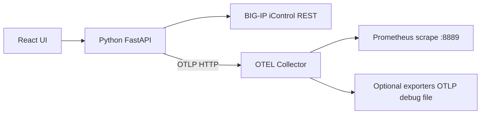
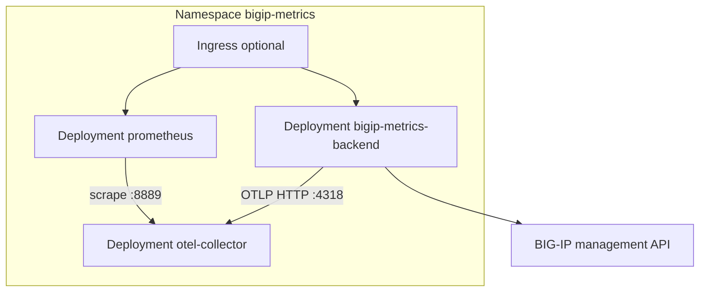

# BIG-IP Metrics Exporter

Pull metrics from F5 BIG-IP iControl REST APIs, export them via **OTLP** to an [OpenTelemetry Collector](https://github.com/open-telemetry/opentelemetry-collector), and validate receipt with a local **Prometheus** instance.

The React UI is styled similarly to [BIG-IP-Telemetry-Streaming-Validator-and-Configurator](https://github.com/gregcoward/BIG-IP-Telemetry-Streaming-Validator-and-Configurator): connect to BIG-IP, select APIs, configure collector exporters, and run export.

## Table of contents

- [Architecture](#architecture)
- [Access from other machines](#access-from-other-machines)
- [API catalog](#api-catalog)
- [Quick start](#quick-start)
  - [1. Observability stack](#1-observability-stack)
  - [2. Python API](#2-python-api)
  - [3. React UI (development)](#3-react-ui-development)
  - [4. Production UI (optional)](#4-production-ui-optional)
- [Workflow](#workflow)
- [Collector exporters (UI)](#collector-exporters-ui)
- [Kubernetes installation](#kubernetes-installation)
  - [Architecture in the cluster](#architecture-in-the-cluster)
  - [Prerequisites](#prerequisites)
  - [Quick install](#quick-install)
  - [Manifests and overlays](#manifests-and-overlays)
  - [Post-install workflow](#post-install-workflow)
  - [Customization](#customization)
- [Repository](#repository)
- [License](#license)

## Architecture



| Component | Role |
|-----------|------|
| **Python backend** | Authenticates to BIG-IP, polls selected `/mgmt/...` endpoints, converts nested stats to metric points, pushes OTLP HTTP to the collector |
| **OTEL Collector** | Receives OTLP; processes with batch/memory_limiter; exposes Prometheus exporter on `:8889` plus any UI-configured exporters |
| **Prometheus** | Scrapes `otel-collector:8889` to confirm metrics flowed through the collector |
| **React frontend** | Connection, API catalog, exporter configuration (writes `otel-collector/generated-config.yaml`), export control |

## API catalog

Endpoints are defined in [`data/bigip_apis.csv`](data/bigip_apis.csv) (parsed from your API list — 84 paths, 33 stats/metrics-oriented by default).

## Access from other machines

Services listen on **all interfaces** (`0.0.0.0`). Use your host’s LAN IP instead of `127.0.0.1` when opening the UI from another device.

```bash
export HOST_IP="$(./scripts/host-ip.sh)"   # e.g. 192.168.1.10
```

| Surface | URL |
|---------|-----|
| API + production UI | `http://<HOST-IP>:8000` |
| Vite dev UI | `http://<HOST-IP>:5173` |
| Prometheus (docker compose) | `http://<HOST-IP>:9090` |
| Collector metrics | `http://<HOST-IP>:8889/metrics` |

Kubernetes port-forward must bind externally:

```bash
kubectl -n bigip-metrics port-forward --address 0.0.0.0 svc/bigip-metrics-backend 8001:8000
# UI at http://<HOST-IP>:8001
```

The UI picks up Prometheus/collector links from the hostname you use in the browser (or set `ACCESS_HOST` on the backend).

## Quick start

### 1. Observability stack

```bash
./scripts/init-collector-config.sh
docker compose up -d
```

- Collector OTLP: `4317` (gRPC), `4318` (HTTP)
- Collector Prometheus exporter (validation): `http://<HOST-IP>:8889/metrics`
- Prometheus UI: `http://<HOST-IP>:9090`

### 2. Python API

```bash
python3 -m venv .venv
source .venv/bin/activate
pip install -r requirements.txt
python run_server.py
```

API listens on `http://<HOST-IP>:8000` (bound to `0.0.0.0`; same machine: `http://127.0.0.1:8000`)

### 3. React UI (development)

```bash
cd frontend && npm install && npm run dev
```

Open `http://<HOST-IP>:5173` (Vite listens on all interfaces; proxies `/api` to port 8000).

### 4. Production UI (optional)

```bash
cd frontend && npm run build
```

Rebuild serves static files from `frontend/dist` via FastAPI.

## Workflow

1. **Connect** to BIG-IP management IP (uses `/mgmt/shared/authn/login` and token extension).
2. **Select endpoints** from the catalog (stats endpoints recommended).
3. **Configure exporters** in the UI → **Apply collector config** → `docker compose restart otel-collector`.
4. **Start export** — backend polls BIG-IP and sends OTLP to `http://127.0.0.1:4318`.
5. **Validate** in Prometheus (query metrics prefixed with `bigip_`, e.g. virtual server stats).

## Collector exporters (UI)

| Type | Purpose |
|------|---------|
| `prometheus` | Expose metrics for Prometheus scrape (validation) |
| `otlp_http` | Forward to remote OTLP/HTTP |
| `otlp_grpc` | Forward to remote OTLP/gRPC |
| `debug` | Log telemetry to collector stdout |
| `file` | Write JSON metrics file in collector container |

Generated config: `otel-collector/generated-config.yaml`

## Kubernetes installation

Deploy the **full application** (backend + UI, OpenTelemetry Collector, Prometheus) with the manifests under [`k8s/`](k8s/) and [Kustomize](https://kustomize.io/).

### Architecture in the cluster



| Workload | Image | Service |
|----------|-------|---------|
| Backend + UI | `bigip-metrics-exporter` (built from [`Dockerfile`](Dockerfile)) | `bigip-metrics-backend:8000` |
| OTEL Collector | `otel/opentelemetry-collector-contrib:0.109.0` | `otel-collector:4317/4318/8889` |
| Prometheus | `prom/prometheus:v2.54.1` | `prometheus:9090` |

### Prerequisites

- Kubernetes cluster (1.25+) and `kubectl`
- **Backend image** built on your machine (and loaded into the cluster or pushed to a registry — it is **not** on Docker Hub)
- **Network access** from pods to your BIG-IP management IP(s)

### Quick install (local cluster)

For kind, minikube, k3d, or Docker Desktop Kubernetes:

```bash
chmod +x scripts/k8s-*.sh
./scripts/k8s-build-image.sh
./scripts/k8s-load-image.sh          # skip if load script warns; Docker Desktop may work without it
./scripts/k8s-deploy.sh local        # imagePullPolicy: Never — uses your local image
```

### Quick install (registry)

When nodes pull from GHCR, ECR, ACR, etc.:

```bash
./scripts/k8s-build-image.sh
export IMAGE=ghcr.io/<you>/bigip-metrics-exporter:1.0.0
docker tag bigip-metrics-exporter:latest "${IMAGE}"
docker push "${IMAGE}"
IMAGE="${IMAGE}" ./scripts/k8s-deploy.sh minimal

# 3. Open the UI (reachable on your LAN IP)
export HOST_IP="$(./scripts/host-ip.sh)"
kubectl -n bigip-metrics port-forward --address 0.0.0.0 svc/bigip-metrics-backend 8001:8000
# http://<HOST-IP>:8001

# 4. After configuring exporters in the UI, sync collector config:
kubectl -n bigip-metrics port-forward --address 0.0.0.0 svc/bigip-metrics-backend 8001:8000 &
./scripts/k8s-apply-collector-config.sh
```

Prometheus (validation):

```bash
kubectl -n bigip-metrics port-forward --address 0.0.0.0 svc/prometheus 9090:9090
# http://<HOST-IP>:9090
```

### Manifests and overlays

| Path | Description |
|------|-------------|
| [`k8s/base/`](k8s/base/) | Namespace, ConfigMaps, Deployments, Services, sample Ingress |
| [`k8s/overlays/local/`](k8s/overlays/local/) | **Local image** (`imagePullPolicy: Never`) — use after `k8s-build-image.sh` + `k8s-load-image.sh` |
| [`k8s/overlays/minimal/`](k8s/overlays/minimal/) | No Ingress; requires `IMAGE=<registry>/...` when deploying |
| [`k8s/overlays/example/`](k8s/overlays/example/) | Example registry + Ingress hostnames |

Do not apply `minimal` without pushing an image first — `bigip-metrics-exporter:latest` is not published to `docker.io`.

### Post-install workflow

1. **Connect** to BIG-IP in the UI (credentials stay in the API session; not stored in cluster Secrets by default).
2. **Select APIs** and **apply collector exporter** settings in the UI.
3. Run [`scripts/k8s-apply-collector-config.sh`](scripts/k8s-apply-collector-config.sh) to update the `otel-collector-config` ConfigMap and restart the collector.
4. **Start export** — the backend sends OTLP to `http://otel-collector.bigip-metrics.svc.cluster.local:4318` (configured via `OTLP_HTTP_ENDPOINT`).
5. **Validate** in Prometheus (targets → `otel-collector`, query metrics with prefix `bigip_`).

### Customization

- **Image**: set `images` in your overlay `kustomization.yaml`.
- **Ingress**: use `k8s/base` or `example` overlay; set `spec.rules[].host` and `ingressClassName`.
- **Env vars** on the backend Deployment: `OTLP_HTTP_ENDPOINT`, `ACCESS_HOST`, `PROMETHEUS_BROWSER_PORT` (see [`docs/kubernetes.md`](docs/kubernetes.md)).

Full troubleshooting, RBAC, upgrades, and BIG-IP connectivity notes: **[`docs/kubernetes.md`](docs/kubernetes.md)**.

## Repository

https://github.com/gregcoward/BIG-IP-Metrics-Exporter

## License

Apache 2.0 — see [LICENSE](LICENSE).
