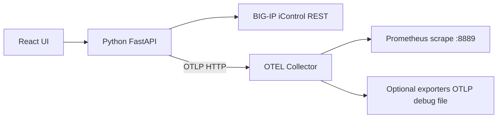

# BIG-IP Metrics Exporter

Pull metrics from F5 BIG-IP iControl REST APIs, export them via **OTLP** to an [OpenTelemetry Collector](https://github.com/open-telemetry/opentelemetry-collector), and validate receipt with a local **Prometheus** instance.

The React UI is styled similarly to [BIG-IP-Telemetry-Streaming-Validator-and-Configurator](https://github.com/gregcoward/BIG-IP-Telemetry-Streaming-Validator-and-Configurator): connect to BIG-IP, select APIs, configure collector exporters, and run export.

## Architecture



| Component | Role |
|-----------|------|
| **Python backend** | Authenticates to BIG-IP, polls selected `/mgmt/...` endpoints, converts nested stats to metric points, pushes OTLP HTTP to the collector |
| **OTEL Collector** | Receives OTLP; processes with batch/memory_limiter; exposes Prometheus exporter on `:8889` plus any UI-configured exporters |
| **Prometheus** | Scrapes `otel-collector:8889` to confirm metrics flowed through the collector |
| **React frontend** | Connection, API catalog, exporter configuration (writes `otel-collector/generated-config.yaml`), export control |

## API catalog

Endpoints are defined in [`data/bigip_apis.csv`](data/bigip_apis.csv) (parsed from your API list — 84 paths, 33 stats/metrics-oriented by default).

## Quick start

### 1. Observability stack

```bash
./scripts/init-collector-config.sh
docker compose up -d
```

- Collector OTLP: `4317` (gRPC), `4318` (HTTP)
- Collector Prometheus exporter (validation): http://127.0.0.1:8889/metrics
- Prometheus UI: http://127.0.0.1:9090

### 2. Python API

```bash
python3 -m venv .venv
source .venv/bin/activate
pip install -r requirements.txt
python run_server.py
```

API listens on http://127.0.0.1:8000

### 3. React UI (development)

```bash
cd frontend && npm install && npm run dev
```

Open http://127.0.0.1:5173 (proxies `/api` to port 8000).

### 4. Production UI (optional)

```bash
cd frontend && npm run build
```

Rebuild serves static files from `frontend/dist` via FastAPI.

## Workflow

1. **Connect** to BIG-IP management IP (uses `/mgmt/shared/authn/login` and token extension).
2. **Select endpoints** from the catalog (stats endpoints recommended).
3. **Configure exporters** in the UI → **Apply collector config** → `docker compose restart otel-collector`.
4. **Start export** — backend polls BIG-IP and sends OTLP to `http://127.0.0.1:4318`.
5. **Validate** in Prometheus (query metrics prefixed with `bigip_`, e.g. virtual server stats).

## Collector exporters (UI)

| Type | Purpose |
|------|---------|
| `prometheus` | Expose metrics for Prometheus scrape (validation) |
| `otlp_http` | Forward to remote OTLP/HTTP |
| `otlp_grpc` | Forward to remote OTLP/gRPC |
| `debug` | Log telemetry to collector stdout |
| `file` | Write JSON metrics file in collector container |

Generated config: `otel-collector/generated-config.yaml`

## Repository

https://github.com/gregcoward/BIG-IP-Metrics-Exporter

## License

MIT — see [LICENSE](LICENSE).
