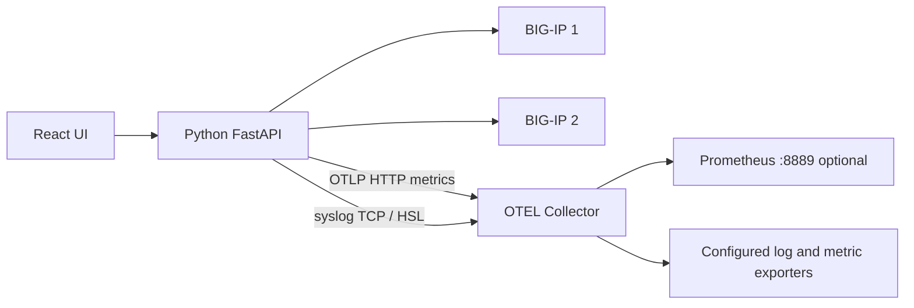
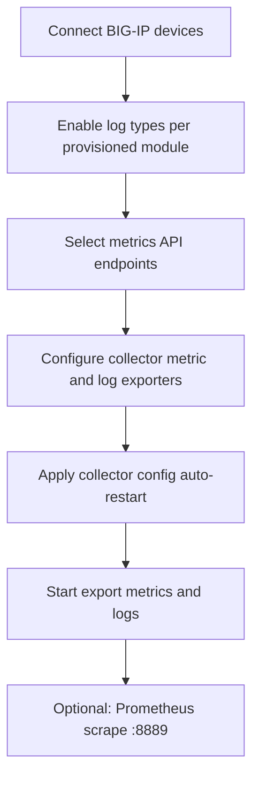
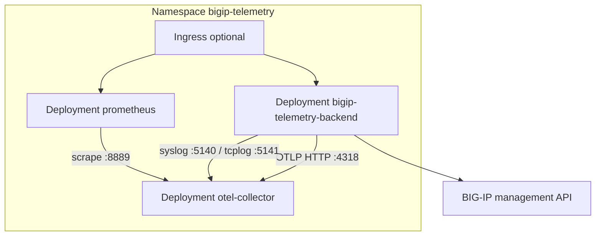

# BIG-IP Telemetry Exporter

Pull **metrics** from F5 BIG-IP iControl REST APIs and forward **logs** from BIG-IP (LTM, ASM, AFM, AVR, and system syslog) to an [OpenTelemetry Collector](https://github.com/open-telemetry/opentelemetry-collector) using separate metric and log pipelines.

The React UI is styled similarly to [BIG-IP-Telemetry-Streaming-Validator-and-Configurator](https://github.com/gregcoward/BIG-IP-Telemetry-Streaming-Configurator): connect to one or more BIG-IPs, choose what to export, configure collector exporters, and start export.

## Table of contents

- [Architecture](#architecture)
- [User guide](#user-guide)
  - [UI overview](#ui-overview)
- [Installation options](#installation-options)
- [Install on Ubuntu Linux (without Kubernetes)](#install-on-ubuntu-linux-without-kubernetes)
  - [Prerequisites](#prerequisites)
  - [Step 1 — Clone the repository](#step-1--clone-the-repository)
  - [Step 2 — Start OpenTelemetry Collector and Prometheus](#step-2--start-opentelemetry-collector-and-prometheus)
  - [Step 3 — Install and run the Python backend](#step-3--install-and-run-the-python-backend)
  - [Step 4 — Build the web UI (production)](#step-4--build-the-web-ui-production)
  - [Step 5 — Use the application](#step-5--use-the-application)
  - [Optional — Development UI (Vite)](#optional--development-ui-vite)
  - [Optional — Firewall (UFW)](#optional--firewall-ufw)
  - [Ubuntu troubleshooting](#ubuntu-troubleshooting)
- [Install on Kubernetes](#install-on-kubernetes)
  - [Architecture in the cluster](#architecture-in-the-cluster)
  - [Prerequisites](#kubernetes-prerequisites)
  - [Step 1 — Build the backend image](#step-1--build-the-backend-image)
  - [Step 2 — Deploy the stack](#step-2--deploy-the-stack)
  - [Step 3 — Open the UI and Prometheus](#step-3--open-the-ui-and-prometheus)
  - [Step 4 — Use the application](#step-4--use-the-application-on-kubernetes)
  - [Step 5 — Uninstall](#step-5--uninstall)
  - [Manifests and overlays](#manifests-and-overlays)
  - [Kubernetes troubleshooting](#kubernetes-troubleshooting)
- [Access from other machines](#access-from-other-machines)
- [User guide (detailed)](docs/user-guide.md)
- [API catalog](#api-catalog)
- [Collector exporters (UI)](#collector-exporters-ui)
- [Backend environment variables (optional)](#backend-environment-variables-optional)
- [Repository](#repository)
- [License](#license)

## Architecture



| Component | Role |
|-----------|------|
| **Python backend** | Sessions to one or more BIG-IPs; polls selected `/mgmt/.../stats` endpoints; configures remote logging via AS3 and system syslog; pushes OTLP metrics to the collector |
| **OTEL Collector** | Receives OTLP metrics on `:4318`; receives BIG-IP logs on syslog `:5140` (ASM/AFM) and tcplog `:5141` (LTM request logging); exposes Prometheus on `:8889` plus UI-configured exporters |
| **Prometheus** (optional) | Scrapes `otel-collector:8889` to verify metrics locally |
| **React frontend** | Multi-BIG-IP connect form, per-device log export toggles (provisioned modules only), API catalog, split metric/log collector exporters, export controls |

## User guide

End-to-end workflow after [installation](#installation-options). Expanded copy: [`docs/user-guide.md`](docs/user-guide.md). Kubernetes networking: [`docs/kubernetes.md`](docs/kubernetes.md).

### Workflow overview



| Step | UI section | Outcome |
|------|------------|---------|
| 1 | **BIG-IP connections** | Authenticate; enable per-device log types (LTM, ASM, AFM, AVR, system) based on provisioned modules |
| 2 | **API endpoints** | Choose which `/mgmt/...` paths to poll for metrics (stats paths recommended) |
| 3 | **OpenTelemetry Collector exporters** | Configure metric and log exporters separately; **Apply collector config** restarts the collector |
| 4 | **Export to collector** | Metrics via OTLP; logs via syslog/tcplog receivers on the collector |
| 5 | **Validate metrics** (optional) | Prometheus UI / `:8889/metrics` to confirm metrics |

### UI overview

| Area | What it shows |
|------|----------------|
| **Connected status bar** (top, when ≥1 device) | Count, chips, export selection summary, **Refresh list**, auto-refresh every 45 seconds |
| **BIG-IP connections** | Device list with export checkboxes, per-device log toggles (LTM/ASM/AFM/AVR when provisioned), system syslog, **Remove**, connect form |
| **API endpoints** | iControl REST path catalog for metrics |
| **OpenTelemetry Collector exporters** | Separate **metric** and **log** exporter sections; apply restarts collector |
| **Export to collector** | OTLP metrics settings and poll interval |

After `git pull`, rebuild the UI if you serve production assets: `cd frontend && npm ci && npm run build`, then restart the API.

### 1. Connect BIG-IP devices

Open the UI (`http://<HOST-IP>:8001` on Ubuntu, or port-forward on Kubernetes).

| Field | Notes |
|-------|--------|
| **Management host** | IP or hostname (HTTPS). `https://` is added automatically if omitted. |
| **Label** | Optional friendly name (e.g. `prod-dc1`). Defaults to the host/IP. |
| **Username / Password** | Account with iControl REST access (often `admin`). |
| **Verify TLS** | Uncheck for default self-signed BIG-IP management certificates. |

- **Connect** / **Add BIG-IP** — enabled when host, username, password, and at least one export option (metrics and/or logs) are selected.
- **Connect** — first device.
- **Add BIG-IP** — additional devices without disconnecting others.
- **Remove** — logs out and drops that session (`DELETE /api/session/{id}`).
- Reconnecting the **same host** replaces the previous session for that IP.

On the connect form, choose **Export metrics**, **Export logs** (AS3 remote logging profiles), and/or **Export system logs** (syslog-ng → collector `:5140`).

The **BIG-IP connections** card shows the count in its title and lists devices when connected. The top status bar appears only after the first device is connected.

Each connected device appears in a list with:

- A **checkbox** — include or exclude from export (at least one must be checked before **Start export**).
- **Label**, management address, and export mode summary.
- **Logs** row — toggles for **LTM**, **ASM**, **AFM**, **AVR** (only if that module is provisioned on the device).
- **System → syslog** — toggle system syslog forwarding to the collector.
- **Warning** — token extension, AS3, syslog, or provisioning issues.
- **Remove** — disconnect the session.

On connect (and when you change log toggles), the backend:

1. Reads module provisioning (`ltm`, `asm`, `afm`, `avr`).
2. Optionally configures **system syslog** forwarding (`/mgmt/tm/sys/syslog` include → TCP `:5140`).
3. If any module log profile is enabled, verifies **F5 AS3**, then **POST**s an AS3 declaration with logging/analytics objects for provisioned modules only:

| Profile | Default path | Attach on virtual server | Collector port |
|---------|--------------|--------------------------|----------------|
| LTM request-log | `/Common/bigip-telemetry-requestlog` | **Request Logging** | HSL tcplog **5141** |
| ASM security log | `/Common/bigip-telemetry-asm-log` | **Security Log Profile** (Application Security) | syslog **5140** |
| AFM security log | `/Common/bigip-telemetry-afm-log` | **Security Log Profile** (Network Firewall) | syslog **5140** |
| AVR HTTP analytics | `/Common/bigip-telemetry-http-analytics` | HTTP **Analytics** profile | (analytics events) |
| AVR TCP analytics | `/Common/bigip-telemetry-tcp-analytics` | TCP **Analytics** profile | (analytics events) |

Use **`PATCH /api/session/{session_id}/log-options`** to change log types on a connected device without reconnecting.

**Log reachability:** BIG-IP must reach the collector host on **5140** and **5141**. The backend auto-detects a LAN IP for remote log pools; set `BIGIP_LOG_SYSLOG_HOST` if auto-detection fails. Do **not** use `127.0.0.1` — BIG-IP rejects loopback destinations.

Credentials stay in the API process memory (not written to disk by default). Restarting the backend clears all sessions.

| Environment variable | Default | Purpose |
|---------------------|---------|---------|
| `BIGIP_REQUEST_LOG_PROFILE_NAME` | `bigip-telemetry-requestlog` | LTM request-log profile name |
| `BIGIP_ASM_LOG_PROFILE_NAME` | `bigip-telemetry-asm-log` | ASM security log profile name |
| `BIGIP_AFM_LOG_PROFILE_NAME` | `bigip-telemetry-afm-log` | AFM security log profile name |
| `BIGIP_LOG_PROFILE_PARTITION` | `Common` | Partition for all exporter-managed profiles |
| `BIGIP_LOG_SYSLOG_HOST` | Auto-detected LAN IP (or browser host); must be reachable from BIG-IP — not `127.0.0.1` |
| `BIGIP_LOG_SYSLOG_PORT` | `5140` | Collector syslog receiver (ASM/AFM security logs, RFC5424) |
| `BIGIP_LOG_HSL_PORT` | `5141` | Collector tcplog receiver (LTM request/response logs via HSL) |
| `BIGIP_REQUEST_LOG_AUTO_CREATE` | `true` | Set `false` to skip LTM profile on connect |
| `BIGIP_ASM_LOG_AUTO_CREATE` | `true` | Set `false` to skip ASM profile on connect |
| `BIGIP_AFM_LOG_AUTO_CREATE` | `true` | Set `false` to skip AFM profile on connect |
| `BIGIP_AFM_LOG_PUBLISHER` | `/Common/local-db-publisher` | Log publisher for AFM network events |
| `BIGIP_HTTP_ANALYTICS_PROFILE_NAME` | `bigip-telemetry-http-analytics` | AVR HTTP analytics profile name |
| `BIGIP_TCP_ANALYTICS_PROFILE_NAME` | `bigip-telemetry-tcp-analytics` | AVR TCP analytics profile name |
| `BIGIP_HTTP_ANALYTICS_AUTO_CREATE` | `true` | Set `false` to skip HTTP analytics profile |
| `BIGIP_TCP_ANALYTICS_AUTO_CREATE` | `true` | Set `false` to skip TCP analytics profile |
| `BIGIP_AS3_RPM_PATH` | _(unset)_ | Local path to `f5-appsvcs-*.noarch.rpm` for auto-install when AS3 is missing |
| `BIGIP_AS3_AUTO_INSTALL` | `true` | Set `false` to require AS3 pre-installed |
| `BIGIP_AS3_SCHEMA_VERSION` | `3.49.0` | AS3 declaration `schemaVersion` when `/info` is unavailable |

### 2. Select API endpoints

The catalog comes from [`data/bigip_apis.csv`](data/bigip_apis.csv) (103 paths; 38 metrics-oriented by default, including ASM event sources and AFM firewall stats).

| Control | Purpose |
|---------|---------|
| **Metrics / stats endpoints only** | Filters to rows marked `collect_metrics=true` |
| **Module filter** | Filters by the CSV `module` column (e.g. **ASM** for `/mgmt/tm/asm/*`, **AFM** for `/mgmt/tm/security/firewall/*`, **SECURITY** for other `/mgmt/tm/security/*`) |
| **Select all visible / Clear** | Bulk selection |
| Per-row checkbox | Individual `/mgmt/...` paths |

Defaults pre-select stats endpoints. Prefer `.../stats` paths for time-series style counters and gauges.

### 3. Configure collector exporters (optional)

The UI has two sections:

- **Metric exporters** — sinks for OTLP metrics from the Python backend (remote OTLP, file, etc.).
- **Log exporters** — sinks for logs received on syslog `:5140` and tcplog `:5141`.

A Prometheus exporter on **:8889** is always included for optional local validation (in addition to exporters you enable).

1. Add or enable exporters in each section.
2. Click **Apply collector config** — writes `otel-collector/generated-config.yaml` and **restarts** the OpenTelemetry Collector (Docker Compose or `kubectl` when available).
3. If restart fails, the UI shows a manual command. Set `COLLECTOR_AUTO_RESTART=false` to only write YAML without restarting.

### 4. Start export

| Field | Ubuntu (default) | Kubernetes |
|-------|------------------|--------------|
| **OTLP HTTP endpoint** | `http://127.0.0.1:4318` | Pre-filled: `http://otel-collector.bigip-telemetry.svc.cluster.local:4318` |
| **Poll interval** | Seconds between full poll cycles (default 30) | Same |

**Start export** runs when at least one connected device is checked for export:

- **Metrics** — polls selected `/mgmt/.../stats` endpoints and sends OTLP metrics to the collector.
- **Logs** — traffic from enabled BIG-IP logging profiles and system syslog reaches the collector on ports **5140** / **5141** (if those features were configured on connect).

Export status (and **Refresh status**) shows `running`, device count, `last_point_count`, `last_errors_by_host`, and `poll_interval_sec`.

**Stop export** ends the background loop.

REST equivalent: `POST /api/export/start` with body `{ "session_ids": ["..."], "endpoints": [...], "poll_interval_sec": 30, "otlp_endpoint": "..." }`. Empty `session_ids` exports all connected devices.

### 5. Validate metrics (optional)

Prometheus is included in the default Docker Compose stack. It scrapes the collector’s Prometheus exporter on **:8889**.

| Link | Default URL |
|------|-------------|
| Prometheus UI | `http://<HOST-IP>:9090` |
| Collector metrics | `http://<HOST-IP>:8889/metrics` |

In Prometheus **Status → Targets**, job `otel-collector` should be **UP**. Example PromQL:

```promql
bigip_tm_sys_memory{bigip_host="10.0.0.50", bigip_stat="memoryused"}
sum by (bigip_host, bigip_stat) (bigip_tm_sys_memory)
```

Labels include `bigip_host`, `bigip_stat`, and `bigip_object`. Metrics whose `bigip_object` contains rolling-average substrings are skipped by default (`BIGIP_EXCLUDE_OBJECT_PATTERNS`).

### Multi-BIG-IP behavior

| Topic | Behavior |
|-------|----------|
| Sessions | One session per device; list via `GET /api/bigips` |
| Metric identity | OTLP instruments keyed per `bigip.host` so values do not overwrite across devices |
| Attributes (Prometheus labels) | `bigip_host` (device), `bigip_stat` (counter name, e.g. `memoryfree`), `bigip_object` (short stats object path) |
| Excluded objects | Metrics whose `bigip_object` contains `fiveminavg`, `fivesecavg`, or `oneminavge` / `oneminavg` are dropped (override: `BIGIP_EXCLUDE_OBJECT_PATTERNS`) |
| Export scope | Only devices checked in the connections list (unless using API with explicit `session_ids`) |
| Network | Each device must be reachable from the host/pod running the Python backend |

### REST API summary

| Method | Path | Purpose |
|--------|------|---------|
| `GET` | `/api/health` | Liveness |
| `GET` | `/api/bigips` | List connected devices |
| `POST` | `/api/connect` | Add or replace device session |
| `DELETE` | `/api/session/{session_id}` | Disconnect device |
| `GET` | `/api/apis` | API catalog |
| `POST` | `/api/export/start` | Start multi-device export |
| `POST` | `/api/export/stop` | Stop export |
| `GET` | `/api/export/status` | Loop status + connected devices |
| `PATCH` | `/api/session/{session_id}/log-options` | Update log export toggles on a connected device |
| `GET` | `/api/exporters/catalog` | Collector contrib exporter types and form fields |
| `GET` | `/api/collector/control` | Collector restart mode and hints |
| `GET` / `POST` | `/api/collector/config` | Read/write collector YAML (POST restarts collector when enabled) |

### Common issues (user-facing)

| Symptom | What to do |
|---------|------------|
| Cannot connect | Ping/curl management IP from the API host/pod; try **Verify TLS** off |
| `401 Authentication failed` | Check user/password and REST permissions |
| Token extension warning | Reconnect before long runs, or ignore if export is under ~20 min |
| AS3 / log profile errors | Check `BIGIP_AS3_RPM_PATH`, module provisioning, and `BIGIP_LOG_SYSLOG_HOST` (must not be loopback) |
| No metrics in Prometheus | Export running? Devices checked for metrics? Collector up? OTLP URL correct? |
| Only one device in metrics | Confirm multiple devices checked; use `bigip_host` in PromQL |
| Log options missing | Module not provisioned on BIG-IP (LTM/ASM/AFM/AVR toggles hidden) |
| `{"detail":"Not Found"}` on `/` | Build UI: `cd frontend && npm ci && npm run build`, restart API |

## Installation options

| Method | Best for |
|--------|----------|
| **[Ubuntu Linux](#install-on-ubuntu-linux-without-kubernetes)** | Single VM or bare-metal host, Docker for collector/Prometheus, Python for API + UI |
| **[Kubernetes](#install-on-kubernetes)** | Clusters (EKS, GKE, OpenShift, kind, etc.) |

Both methods run the same components; only packaging and networking differ.

---

## Install on Ubuntu Linux (without Kubernetes)

These steps target **Ubuntu 22.04 or 24.04 LTS** on a host that can reach your BIG-IP management IP (HTTPS, typically port **443**).

### Prerequisites

Install system packages, Docker, and Node.js (Node is only required to build the UI).

```bash
sudo apt-get update
sudo apt-get install -y git curl ca-certificates python3 python3-venv python3-pip

# Docker Engine + Compose plugin (official convenience script)
curl -fsSL https://get.docker.com | sudo sh
sudo usermod -aG docker "$USER"
# Log out and back in so the docker group applies, then:
docker compose version

# Node.js 20.x (for building the React UI)
curl -fsSL https://deb.nodesource.com/setup_20.x | sudo -E bash -
sudo apt-get install -y nodejs
node --version
npm --version
```

Confirm the host can reach BIG-IP (replace with your management IP):

```bash
curl -sk --connect-timeout 5 https://<BIG-IP-MGMT-IP>/mgmt/shared/ident | head -c 200
```

### Step 1 — Clone the repository

```bash
cd ~
git clone https://github.com/gregcoward/BIG-IP-Telemetry-Exporter.git
cd BIG-IP-Telemetry-Exporter
chmod +x scripts/*.sh
```

### Step 2 — Start OpenTelemetry Collector and Prometheus

```bash
./scripts/init-collector-config.sh
docker compose up -d
docker compose ps
```

Verify containers are running:

| Service | Port | Purpose |
|---------|------|---------|
| `otel-collector` | 4318 | OTLP HTTP (backend sends metrics here) |
| `otel-collector` | 5140 | Syslog receiver (ASM/AFM security logs, system syslog) |
| `otel-collector` | 5141 | tcplog receiver (LTM request/response logs via HSL) |
| `otel-collector` | 8889 | Prometheus exporter (`/metrics`) |
| `prometheus` | 9090 | Prometheus UI |

```bash
export HOST_IP="$(./scripts/host-ip.sh)"
curl -s "http://${HOST_IP}:8889/metrics" | head -5
curl -s "http://${HOST_IP}:9090/-/ready"
```

### Step 3 — Install and run the Python backend

```bash
cd ~/BIG-IP-Telemetry-Exporter
python3 -m venv .venv
source .venv/bin/activate
pip install --upgrade pip
pip install -r requirements.txt
```

Run the API (listens on **all interfaces**, port **8001** by default — avoids conflict with other services on 8000):

```bash
source .venv/bin/activate
python run_server.py
# Default port 8001. Override: PORT=8002 python run_server.py
```

> **Note:** The Docker/Kubernetes image sets `PORT=8000` inside the container (service port 8000). Local `run_server.py` defaults to **8001** unless `PORT` is set.

Leave this terminal open, or run in the background:

```bash
nohup .venv/bin/python run_server.py > /tmp/bigip-telemetry-api.log 2>&1 &
curl -s http://127.0.0.1:8001/api/health
```

### Step 4 — Build the web UI (required for the web page)

The UI is **not** in git — you must build it once. In a **new terminal**:

```bash
cd ~/BIG-IP-Telemetry-Exporter/frontend
npm ci
npm run build
ls -la dist/index.html   # must exist
```

The backend serves files from `frontend/dist`. Restart `run_server.py` if it was already running.

If you open the app **before** building, you will see `{"detail":"Not Found"}` or a setup hint page instead of the UI.

Open the application:

```bash
export HOST_IP="$(./scripts/host-ip.sh)"
echo "UI: http://${HOST_IP}:8001"
```

### Step 5 — Use the application

Follow the **[User guide](#user-guide)**. Quick checklist:

1. Open **`http://<HOST-IP>:8001`**.
2. **BIG-IP connections** — connect with **Export metrics** and/or **Export logs**; use per-device toggles for LTM/ASM/AFM/AVR and system syslog.
3. **API endpoints** — select stats paths (defaults are pre-selected).
4. **Collector exporters** (optional) → **Apply collector config** (auto-restarts collector).
5. **Export** — OTLP `http://127.0.0.1:4318` → **Start export**.
6. **Validate** (optional) — Prometheus at `http://<HOST-IP>:9090`, query `bigip_*` (use `bigip_host` when multiple devices).

For log export, ensure BIG-IP can reach this host on **5140** and **5141**. Set `BIGIP_LOG_SYSLOG_HOST` if auto-detection picks the wrong address.

### Optional — Development UI (Vite)

Use this if you are changing the React code (hot reload). Requires the backend from Step 3.

```bash
cd ~/BIG-IP-Telemetry-Exporter/frontend
npm run dev
```

Open **`http://<HOST-IP>:5173`** (proxies `/api` to port 8001).

### Optional — Firewall (UFW)

If UFW is enabled, allow the ports you need:

```bash
sudo ufw allow 8001/tcp comment 'BIG-IP Telemetry UI/API'
sudo ufw allow 9090/tcp comment 'Prometheus'
# Required for BIG-IP remote logging when exporting logs:
sudo ufw allow 5140/tcp comment 'OTEL syslog receiver'
sudo ufw allow 5141/tcp comment 'OTEL HSL tcplog receiver'
# Only if remote hosts must scrape collector metrics directly:
sudo ufw allow 8889/tcp comment 'OTEL Prometheus exporter'
```

### Ubuntu troubleshooting

| Symptom | What to check |
|---------|----------------|
| `Cannot reach BIG-IP` | Routing/firewall from Ubuntu host to management IP; `curl -sk https://<IP>/mgmt/shared/ident` |
| `401 Authentication failed` | Username/password; account not locked; user has iControl REST permission |
| `Login failed` / TLS errors | Try with **Verify TLS** unchecked, or install the BIG-IP management CA on Ubuntu |
| `Token extension failed` | Warning only — connection can still work (~20 min token); fix token PATCH if needed |
| No metrics in Prometheus | Export started? Devices checked for metrics? `docker compose logs otel-collector`; OTLP `http://127.0.0.1:4318` |
| No logs in collector | BIG-IP can reach host on 5140/5141? `BIGIP_LOG_SYSLOG_HOST` not loopback? Profiles attached on virtual servers? |
| Multiple devices, one host in queries | Use `bigip_host` label in PromQL; confirm all devices were checked before export |
| `{"detail":"Not Found"}` on `/` | Run Step 4: `cd frontend && npm ci && npm run build`, restart API |
| UI blank after build | `frontend/dist` exists; restart `python run_server.py` |
| `docker compose` not found | Install compose plugin: `sudo apt-get install docker-compose-plugin` |

Stop the stack:

```bash
docker compose down
# stop API: kill the run_server.py process or Ctrl+C
```

---

## Install on Kubernetes

Deploy the **full application** (backend + UI, OpenTelemetry Collector, Prometheus) with manifests under [`k8s/`](k8s/) and [Kustomize](https://kustomize.io/).

Detailed guide: **[`docs/kubernetes.md`](docs/kubernetes.md)**

### Architecture in the cluster



| Workload | Image | Service |
|----------|-------|---------|
| Backend + UI | `bigip-telemetry-exporter` (built from [`Dockerfile`](Dockerfile)) | `bigip-telemetry-backend:8000` |
| OTEL Collector | `otel/opentelemetry-collector-contrib:0.109.0` | `otel-collector:4317/4318/8889` |
| Prometheus | `prom/prometheus:v2.54.1` | `prometheus:9090` |

### Kubernetes prerequisites

- Kubernetes **1.25+** and `kubectl`
- **Docker** on your workstation to build the backend image
- Cluster nodes (or pod network) can reach BIG-IP management IP(s) on HTTPS
- The backend image is **not** on Docker Hub — you must build and load/push it (see below)

### Step 1 — Build the backend image

```bash
git clone https://github.com/gregcoward/BIG-IP-Telemetry-Exporter.git
cd BIG-IP-Telemetry-Exporter
chmod +x scripts/k8s-*.sh   # build, deploy, apply-collector-config, uninstall
./scripts/k8s-build-image.sh
```

**Local cluster** (kind / minikube / k3d):

```bash
./scripts/k8s-load-image.sh
```

**Remote cluster** (registry):

```bash
export IMAGE=ghcr.io/<you>/bigip-telemetry-exporter:1.0.0
docker tag bigip-telemetry-exporter:latest "${IMAGE}"
docker push "${IMAGE}"
```

### Step 2 — Deploy the stack

**Local image** (no registry):

```bash
./scripts/k8s-deploy.sh local
```

**Registry image**:

```bash
IMAGE="${IMAGE}" ./scripts/k8s-deploy.sh minimal
```

Wait for pods:

```bash
kubectl -n bigip-telemetry get pods
```

### Step 3 — Open the UI and Prometheus

Bind port-forwards on all interfaces so other machines can use your host IP:

```bash
export HOST_IP="$(./scripts/host-ip.sh)"

kubectl -n bigip-telemetry port-forward --address 0.0.0.0 svc/bigip-telemetry-backend 8001:8000
# UI: http://<HOST-IP>:8001

# In another terminal:
kubectl -n bigip-telemetry port-forward --address 0.0.0.0 svc/prometheus 9090:9090
# Prometheus: http://<HOST-IP>:9090
```

### Step 4 — Use the application on Kubernetes

Follow the **[User guide](#user-guide)**. Kubernetes-specific checklist:

1. Open **`http://<HOST-IP>:8001`** (port-forward `8001:8000`).
2. Connect with **Export metrics** and/or log options; use per-device LTM/ASM/AFM/AVR and system syslog toggles.
3. Select APIs; configure **metric** and **log** collector exporters → **Apply collector config** (auto-restarts collector, or run `./scripts/k8s-apply-collector-config.sh`).
4. **Start export** — OTLP endpoint should remain the in-cluster URL (`http://otel-collector.bigip-telemetry.svc.cluster.local:4318`).
5. For log export, ensure BIG-IP can reach collector **5140** / **5141**; set `BIGIP_LOG_SYSLOG_HOST` on the backend if needed.
6. Validate metrics (optional) at **`http://<HOST-IP>:9090`** (second port-forward).

### Step 5 — Uninstall

Use the **same overlay** you deployed with (`local`, `minimal`, or `example`):

```bash
./scripts/k8s-uninstall.sh local
```

Skip the confirmation prompt:

```bash
./scripts/k8s-uninstall.sh local -y
```

Remove workloads but keep the namespace (for redeploy later):

```bash
./scripts/k8s-uninstall.sh local --keep-namespace
```

Manual equivalent (deletes namespace and all resources):

```bash
kubectl delete -k k8s/overlays/local --wait
```

After uninstall:

- Stop any `kubectl port-forward` sessions still running.
- Optionally remove the local Docker image: `docker rmi bigip-telemetry-exporter:latest`

### Manifests and overlays

| Path | Description |
|------|-------------|
| [`k8s/base/`](k8s/base/) | Namespace, ConfigMaps, Deployments, Services, sample Ingress |
| [`k8s/overlays/local/`](k8s/overlays/local/) | Local image (`imagePullPolicy: Never`) |
| [`k8s/overlays/minimal/`](k8s/overlays/minimal/) | No Ingress; requires `IMAGE=<registry>/...` |
| [`k8s/overlays/example/`](k8s/overlays/example/) | Example registry + Ingress hostnames |

Do not deploy `minimal` without pushing an image — `bigip-telemetry-exporter:latest` is not published to `docker.io`.

### Kubernetes troubleshooting

| Symptom | What to check |
|---------|----------------|
| `ErrImagePull` / `authorization failed` | Image not on Docker Hub — use [`local` overlay](#step-2--deploy-the-stack) or push to your registry |
| `401` / connect errors in UI | Pod network → BIG-IP management IP; TLS verify setting |
| No metrics in Prometheus | Export started? Devices checked for metrics? `kubectl logs -n bigip-telemetry deploy/otel-collector` |
| No logs in collector | BIG-IP → collector on 5140/5141? `BIGIP_LOG_SYSLOG_HOST`? Log exporters configured? |
| Backend pod not ready | Probes hit port 8000 — image must set `PORT=8000` (included in `Dockerfile`) |
| Port-forward only on localhost | Add `--address 0.0.0.0` (see Step 3) |

---

## Access from other machines

Services listen on **`0.0.0.0`**. Use the Ubuntu host’s LAN IP instead of `127.0.0.1` when opening the UI from another workstation.

```bash
export HOST_IP="$(./scripts/host-ip.sh)"   # e.g. 192.168.1.10
```

| Surface | Ubuntu (default) | Kubernetes (port-forward) |
|---------|------------------|---------------------------|
| UI + API | `http://<HOST-IP>:8001` | `http://<HOST-IP>:8001` (port-forward → pod :8000) |
| Vite dev UI | `http://<HOST-IP>:5173` | — |
| Prometheus | `http://<HOST-IP>:9090` | `http://<HOST-IP>:9090` |
| Collector `/metrics` | `http://<HOST-IP>:8889/metrics` | (in-cluster scrape) |

The UI builds Prometheus/collector links from the browser hostname you use (or set `ACCESS_HOST` on the backend in Kubernetes).

## API catalog

Endpoints are defined in [`data/bigip_apis.csv`](data/bigip_apis.csv) (103 iControl REST paths; 38 stats/metrics-oriented by default).

## Collector exporters (UI)

The UI configures exporters from the [OpenTelemetry Collector Contrib](https://github.com/open-telemetry/opentelemetry-collector-contrib/tree/main/exporter) distribution (image: `otel/opentelemetry-collector-contrib`).

| Category | Examples |
|----------|----------|
| **Core** | OTLP HTTP/gRPC, debug, file, OTel Arrow |
| **Observability** | Datadog, Splunk HEC, SignalFx, Coralogix, Logz.io, Sumo Logic, Mezmo, Sematext, LogicMonitor |
| **Cloud** | Google Cloud, Google Managed Prometheus, AWS S3, AWS EMF, Azure Monitor |
| **Storage** | Elasticsearch, InfluxDB, OpenSearch, ClickHouse, Cassandra |
| **Messaging** | Kafka, Pulsar, RabbitMQ, syslog |
| **Advanced** | **Contrib exporter (custom YAML)** — any other contrib component; paste settings from upstream docs |

A Prometheus exporter on **:8889** is always added for local validation (in addition to exporters you enable).

After **Apply collector config**, the API restarts the collector when docker or kubectl is available. Set `COLLECTOR_AUTO_RESTART=false` to disable.

- **Ubuntu (manual fallback):** `docker compose restart otel-collector`
- **Kubernetes:** `./scripts/k8s-apply-collector-config.sh`

Generated config file: `otel-collector/generated-config.yaml`

Catalog API: `GET /api/exporters/catalog` (categories, field schemas, links to [contrib exporter docs](https://github.com/open-telemetry/opentelemetry-collector-contrib/tree/main/exporter)).

## Backend environment variables (optional)

| Variable | Default | Purpose |
|----------|---------|---------|
| `BIGIP_EXCLUDE_OBJECT_PATTERNS` | `fiveminavg,fivesecavg,oneminavge,oneminavg` | Comma-separated substrings; if `bigip_object` contains any, the metric is skipped |
| `PORT` | `8001` (local), `8000` (Docker/K8s image) | API listen port |
| `OTLP_HTTP_ENDPOINT` | `http://127.0.0.1:4318` | Default OTLP URL in UI (K8s manifest overrides) |
| `PROMETHEUS_UI_URL` | *(unset)* | Override Prometheus UI base URL for link generation |
| `COLLECTOR_AUTO_RESTART` | `true` | Set `false` to write config without restarting the collector |
| `COLLECTOR_RESTART_CMD` | _(unset)_ | Custom restart command (overrides auto-detect) |
| `COLLECTOR_RESTART_MODE` | auto | `docker`, `kubernetes`, or `none` |
| `COLLECTOR_HEALTH_URL` | `http://127.0.0.1:13133` | Health check after restart |
| `COLLECTOR_CONFIG_PATH` | `otel-collector/generated-config.yaml` | Path written by **Apply collector config** |

## Repository

https://github.com/gregcoward/BIG-IP-Telemetry-Exporter

## License

Apache 2.0 — see [LICENSE](LICENSE).
