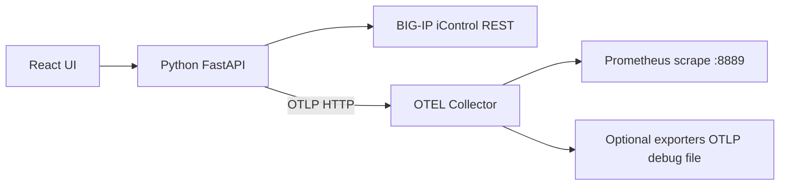
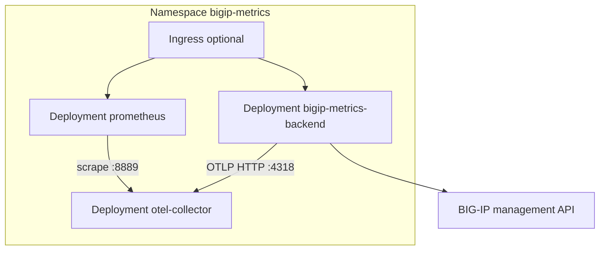

# BIG-IP Metrics Exporter

Pull metrics from F5 BIG-IP iControl REST APIs, export them via **OTLP** to an [OpenTelemetry Collector](https://github.com/open-telemetry/opentelemetry-collector), and validate receipt with a local **Prometheus** instance.

The React UI is styled similarly to [BIG-IP-Telemetry-Streaming-Validator-and-Configurator](https://github.com/gregcoward/BIG-IP-Telemetry-Streaming-Validator-and-Configurator): connect to BIG-IP, select APIs, configure collector exporters, and run export.

## Table of contents

- [Architecture](#architecture)
- [Installation options](#installation-options)
- [Install on Ubuntu Linux (without Kubernetes)](#install-on-ubuntu-linux-without-kubernetes)
  - [Prerequisites](#prerequisites)
  - [Step 1 — Clone the repository](#step-1--clone-the-repository)
  - [Step 2 — Start OpenTelemetry Collector and Prometheus](#step-2--start-opentelemetry-collector-and-prometheus)
  - [Step 3 — Install and run the Python backend](#step-3--install-and-run-the-python-backend)
  - [Step 4 — Build the web UI (production)](#step-4--build-the-web-ui-production)
  - [Step 5 — Use the application](#step-5--use-the-application)
  - [Optional — Development UI (Vite)](#optional--development-ui-vite)
  - [Optional — Firewall (UFW)](#optional--firewall-ufw)
  - [Ubuntu troubleshooting](#ubuntu-troubleshooting)
- [Install on Kubernetes](#install-on-kubernetes)
  - [Architecture in the cluster](#architecture-in-the-cluster)
  - [Prerequisites](#kubernetes-prerequisites)
  - [Step 1 — Build the backend image](#step-1--build-the-backend-image)
  - [Step 2 — Deploy the stack](#step-2--deploy-the-stack)
  - [Step 3 — Open the UI and Prometheus](#step-3--open-the-ui-and-prometheus)
  - [Step 4 — Use the application](#step-4--use-the-application-on-kubernetes)
  - [Step 5 — Uninstall](#step-5--uninstall)
  - [Manifests and overlays](#manifests-and-overlays)
  - [Kubernetes troubleshooting](#kubernetes-troubleshooting)
- [Access from other machines](#access-from-other-machines)
- [API catalog](#api-catalog)
- [Collector exporters (UI)](#collector-exporters-ui)
- [Repository](#repository)
- [License](#license)

## Architecture



| Component | Role |
|-----------|------|
| **Python backend** | Authenticates to BIG-IP, polls selected `/mgmt/...` endpoints, converts nested stats to metric points, pushes OTLP HTTP to the collector |
| **OTEL Collector** | Receives OTLP; processes with batch/memory_limiter; exposes Prometheus exporter on `:8889` plus any UI-configured exporters |
| **Prometheus** | Scrapes `otel-collector:8889` to confirm metrics flowed through the collector |
| **React frontend** | Connection, API catalog, exporter configuration, export control |

## Installation options

| Method | Best for |
|--------|----------|
| **[Ubuntu Linux](#install-on-ubuntu-linux-without-kubernetes)** | Single VM or bare-metal host, Docker for collector/Prometheus, Python for API + UI |
| **[Kubernetes](#install-on-kubernetes)** | Clusters (EKS, GKE, OpenShift, kind, etc.) |

Both methods run the same components; only packaging and networking differ.

---

## Install on Ubuntu Linux (without Kubernetes)

These steps target **Ubuntu 22.04 or 24.04 LTS** on a host that can reach your BIG-IP management IP (HTTPS, typically port **443**).

### Prerequisites

Install system packages, Docker, and Node.js (Node is only required to build the UI).

```bash
sudo apt-get update
sudo apt-get install -y git curl ca-certificates python3 python3-venv python3-pip

# Docker Engine + Compose plugin (official convenience script)
curl -fsSL https://get.docker.com | sudo sh
sudo usermod -aG docker "$USER"
# Log out and back in so the docker group applies, then:
docker compose version

# Node.js 20.x (for building the React UI)
curl -fsSL https://deb.nodesource.com/setup_20.x | sudo -E bash -
sudo apt-get install -y nodejs
node --version
npm --version
```

Confirm the host can reach BIG-IP (replace with your management IP):

```bash
curl -sk --connect-timeout 5 https://<BIG-IP-MGMT-IP>/mgmt/shared/ident | head -c 200
```

### Step 1 — Clone the repository

```bash
cd ~
git clone https://github.com/gregcoward/BIG-IP-Metrics-Exporter.git
cd BIG-IP-Metrics-Exporter
chmod +x scripts/*.sh
```

### Step 2 — Start OpenTelemetry Collector and Prometheus

```bash
./scripts/init-collector-config.sh
docker compose up -d
docker compose ps
```

Verify containers are running:

| Service | Port | Purpose |
|---------|------|---------|
| `otel-collector` | 4318 | OTLP HTTP (backend sends metrics here) |
| `otel-collector` | 8889 | Prometheus exporter (`/metrics`) |
| `prometheus` | 9090 | Prometheus UI |

```bash
export HOST_IP="$(./scripts/host-ip.sh)"
curl -s "http://${HOST_IP}:8889/metrics" | head -5
curl -s "http://${HOST_IP}:9090/-/ready"
```

### Step 3 — Install and run the Python backend

```bash
cd ~/BIG-IP-Metrics-Exporter
python3 -m venv .venv
source .venv/bin/activate
pip install --upgrade pip
pip install -r requirements.txt
```

Run the API (listens on **all interfaces**, port **8001** — avoids conflict with other services on 8000):

```bash
source .venv/bin/activate
python run_server.py
# listens on port 8001 (override: PORT=8002 python run_server.py)
```

Leave this terminal open, or run in the background:

```bash
nohup .venv/bin/python run_server.py > /tmp/bigip-metrics-api.log 2>&1 &
curl -s http://127.0.0.1:8001/api/health
```

### Step 4 — Build the web UI (production)

In a **new terminal** on the same host:

```bash
cd ~/BIG-IP-Metrics-Exporter/frontend
npm ci
npm run build
```

The backend serves the built UI from `frontend/dist`. Restart `run_server.py` if it was already running so it picks up the new files.

Open the application:

```bash
export HOST_IP="$(./scripts/host-ip.sh)"
echo "UI: http://${HOST_IP}:8001"
```

### Step 5 — Use the application

1. Open **`http://<HOST-IP>:8001`** in a browser.
2. **BIG-IP connection** — enter management IP (e.g. `172.16.60.123`), username, password. Uncheck **Verify TLS** if using the default self-signed management certificate.
3. **API endpoints** — select stats endpoints (defaults favor `/stats` paths).
4. **OpenTelemetry Collector exporters** — configure exporters → **Apply collector config** → restart collector:
   ```bash
   docker compose restart otel-collector
   ```
5. **Export to collector** — leave OTLP endpoint as `http://127.0.0.1:4318` (backend on the same host as Docker) → **Start export**.
6. **Prometheus validation** — open `http://<HOST-IP>:9090`, check **Status → Targets** (`otel-collector` up), query e.g. `bigip_` metrics.

### Optional — Development UI (Vite)

Use this if you are changing the React code (hot reload). Requires the backend from Step 3.

```bash
cd ~/BIG-IP-Metrics-Exporter/frontend
npm run dev
```

Open **`http://<HOST-IP>:5173`** (proxies `/api` to port 8001).

### Optional — Firewall (UFW)

If UFW is enabled, allow the ports you need:

```bash
sudo ufw allow 8001/tcp comment 'BIG-IP Metrics UI/API'
sudo ufw allow 9090/tcp comment 'Prometheus'
# Only if remote hosts must scrape collector metrics directly:
sudo ufw allow 8889/tcp comment 'OTEL Prometheus exporter'
```

### Ubuntu troubleshooting

| Symptom | What to check |
|---------|----------------|
| `Cannot reach BIG-IP` | Routing/firewall from Ubuntu host to management IP; `curl -sk https://<IP>/mgmt/shared/ident` |
| `401 Authentication failed` | Username/password; account not locked; user has iControl REST permission |
| `Login failed` / TLS errors | Try with **Verify TLS** unchecked, or install the BIG-IP management CA on Ubuntu |
| `Token extension failed` | Warning only — connection can still work (~20 min token); fix token PATCH if needed |
| No metrics in Prometheus | Export started in UI? `docker compose logs otel-collector`; OTLP URL `http://127.0.0.1:4318` |
| UI blank after build | `frontend/dist` exists; restart `python run_server.py` |
| `docker compose` not found | Install compose plugin: `sudo apt-get install docker-compose-plugin` |

Stop the stack:

```bash
docker compose down
# stop API: kill the run_server.py process or Ctrl+C
```

---

## Install on Kubernetes

Deploy the **full application** (backend + UI, OpenTelemetry Collector, Prometheus) with manifests under [`k8s/`](k8s/) and [Kustomize](https://kustomize.io/).

Detailed guide: **[`docs/kubernetes.md`](docs/kubernetes.md)**

### Architecture in the cluster



| Workload | Image | Service |
|----------|-------|---------|
| Backend + UI | `bigip-metrics-exporter` (built from [`Dockerfile`](Dockerfile)) | `bigip-metrics-backend:8000` |
| OTEL Collector | `otel/opentelemetry-collector-contrib:0.109.0` | `otel-collector:4317/4318/8889` |
| Prometheus | `prom/prometheus:v2.54.1` | `prometheus:9090` |

### Kubernetes prerequisites

- Kubernetes **1.25+** and `kubectl`
- **Docker** on your workstation to build the backend image
- Cluster nodes (or pod network) can reach BIG-IP management IP(s) on HTTPS
- The backend image is **not** on Docker Hub — you must build and load/push it (see below)

### Step 1 — Build the backend image

```bash
git clone https://github.com/gregcoward/BIG-IP-Metrics-Exporter.git
cd BIG-IP-Metrics-Exporter
chmod +x scripts/k8s-*.sh   # build, deploy, apply-collector-config, uninstall
./scripts/k8s-build-image.sh
```

**Local cluster** (kind / minikube / k3d):

```bash
./scripts/k8s-load-image.sh
```

**Remote cluster** (registry):

```bash
export IMAGE=ghcr.io/<you>/bigip-metrics-exporter:1.0.0
docker tag bigip-metrics-exporter:latest "${IMAGE}"
docker push "${IMAGE}"
```

### Step 2 — Deploy the stack

**Local image** (no registry):

```bash
./scripts/k8s-deploy.sh local
```

**Registry image**:

```bash
IMAGE="${IMAGE}" ./scripts/k8s-deploy.sh minimal
```

Wait for pods:

```bash
kubectl -n bigip-metrics get pods
```

### Step 3 — Open the UI and Prometheus

Bind port-forwards on all interfaces so other machines can use your host IP:

```bash
export HOST_IP="$(./scripts/host-ip.sh)"

kubectl -n bigip-metrics port-forward --address 0.0.0.0 svc/bigip-metrics-backend 8001:8000
# UI: http://<HOST-IP>:8001

# In another terminal:
kubectl -n bigip-metrics port-forward --address 0.0.0.0 svc/prometheus 9090:9090
# Prometheus: http://<HOST-IP>:9090
```

### Step 4 — Use the application on Kubernetes

1. Open **`http://<HOST-IP>:8001`**.
2. Connect to BIG-IP (credentials are held in the API session, not in Kubernetes Secrets by default).
3. Select APIs and **Apply collector config** in the UI.
4. Sync collector config into the cluster (with backend port-forward active):

   ```bash
   ./scripts/k8s-apply-collector-config.sh
   ```

5. **Start export** — backend uses in-cluster OTLP: `http://otel-collector.bigip-metrics.svc.cluster.local:4318`.
6. Validate in Prometheus at **`http://<HOST-IP>:9090`**.

### Step 5 — Uninstall

Use the **same overlay** you deployed with (`local`, `minimal`, or `example`):

```bash
./scripts/k8s-uninstall.sh local
```

Skip the confirmation prompt:

```bash
./scripts/k8s-uninstall.sh local -y
```

Remove workloads but keep the namespace (for redeploy later):

```bash
./scripts/k8s-uninstall.sh local --keep-namespace
```

Manual equivalent (deletes namespace and all resources):

```bash
kubectl delete -k k8s/overlays/local --wait
```

After uninstall:

- Stop any `kubectl port-forward` sessions still running.
- Optionally remove the local Docker image: `docker rmi bigip-metrics-exporter:latest`

### Manifests and overlays

| Path | Description |
|------|-------------|
| [`k8s/base/`](k8s/base/) | Namespace, ConfigMaps, Deployments, Services, sample Ingress |
| [`k8s/overlays/local/`](k8s/overlays/local/) | Local image (`imagePullPolicy: Never`) |
| [`k8s/overlays/minimal/`](k8s/overlays/minimal/) | No Ingress; requires `IMAGE=<registry>/...` |
| [`k8s/overlays/example/`](k8s/overlays/example/) | Example registry + Ingress hostnames |

Do not deploy `minimal` without pushing an image — `bigip-metrics-exporter:latest` is not published to `docker.io`.

### Kubernetes troubleshooting

| Symptom | What to check |
|---------|----------------|
| `ErrImagePull` / `authorization failed` | Image not on Docker Hub — use [`local` overlay](#step-2--deploy-the-stack) or push to your registry |
| `401` / connect errors in UI | Pod network → BIG-IP management IP; TLS verify setting |
| No metrics in Prometheus | Export started? `kubectl logs -n bigip-metrics deploy/otel-collector` |
| Port-forward only on localhost | Add `--address 0.0.0.0` (see Step 3) |

---

## Access from other machines

Services listen on **`0.0.0.0`**. Use the Ubuntu host’s LAN IP instead of `127.0.0.1` when opening the UI from another workstation.

```bash
export HOST_IP="$(./scripts/host-ip.sh)"   # e.g. 192.168.1.10
```

| Surface | Ubuntu (default) | Kubernetes (port-forward) |
|---------|------------------|---------------------------|
| UI + API | `http://<HOST-IP>:8001` | `http://<HOST-IP>:8001` (port-forward → pod :8000) |
| Vite dev UI | `http://<HOST-IP>:5173` | — |
| Prometheus | `http://<HOST-IP>:9090` | `http://<HOST-IP>:9090` |
| Collector `/metrics` | `http://<HOST-IP>:8889/metrics` | (in-cluster scrape) |

The UI builds Prometheus/collector links from the browser hostname you use (or set `ACCESS_HOST` on the backend in Kubernetes).

## API catalog

Endpoints are defined in [`data/bigip_apis.csv`](data/bigip_apis.csv) (84 iControl REST paths; 33 stats/metrics-oriented by default).

## Collector exporters (UI)

| Type | Purpose |
|------|---------|
| `prometheus` | Expose metrics for Prometheus scrape (validation) |
| `otlp_http` | Forward to remote OTLP/HTTP |
| `otlp_grpc` | Forward to remote OTLP/gRPC |
| `debug` | Log telemetry to collector stdout |
| `file` | Write JSON metrics file in collector container |

After **Apply collector config**, restart the collector:

- **Ubuntu:** `docker compose restart otel-collector`
- **Kubernetes:** `./scripts/k8s-apply-collector-config.sh`

Generated config file: `otel-collector/generated-config.yaml`

## Repository

https://github.com/gregcoward/BIG-IP-Metrics-Exporter

## License

Apache 2.0 — see [LICENSE](LICENSE).
