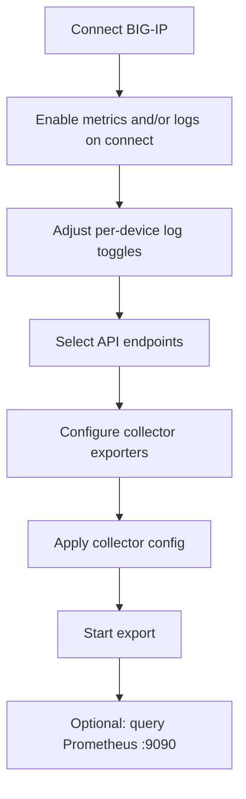

# User guide

Detailed companion to the [User guide section in README](../README.md). Assumes the stack is installed ([Ubuntu](../README.md#install-on-ubuntu-linux-without-kubernetes) or [Kubernetes](kubernetes.md)).

## Prerequisites

- UI reachable at `http://<HOST-IP>:8001`
- OpenTelemetry Collector running (Docker Compose on Ubuntu, or cluster workload on Kubernetes)
- Network path from the **Python backend** to each BIG-IP management IP (HTTPS, typically port 443)
- For log export: network path from each **BIG-IP** to the collector host on **5140** (syslog) and **5141** (HSL tcplog)
- For AS3 logging profiles: **F5 AS3** on the BIG-IP, or `BIGIP_AS3_RPM_PATH` pointing at a local `f5-appsvcs-*.noarch.rpm` for automatic install on connect

After upgrading the repo, rebuild the UI when not using Vite dev mode:

```bash
cd frontend && npm ci && npm run build
```

Then restart the API.

## UI layout

| Area | Purpose |
|------|---------|
| **Connected status bar** | Shown when at least one device is connected: count, chips, **Refresh list** (auto-refreshes every 45s) |
| **BIG-IP connections** | Device list with export checkboxes, per-device log toggles, connect form |
| **API endpoints** | iControl REST path catalog for metric polling |
| **OpenTelemetry Collector exporters** | Separate **metric** and **log** exporter sections; apply restarts collector |
| **Export to collector** | OTLP metrics push settings and poll interval |

## Workflow



## 1. Connect BIG-IP devices

### Connect form

| Field | Notes |
|-------|--------|
| **Management host** | IP or hostname (HTTPS). `https://` is added if omitted. |
| **Label** | Optional friendly name shown in the device list. |
| **Username / Password** | Account with iControl REST access. |
| **Verify TLS** | Uncheck for default self-signed management certificates. |

**On connect** options:

| Checkbox | Effect |
|----------|--------|
| **Export metrics** | Include device in metric polling (OTLP → collector). |
| **Export logs** | Deploy AS3 remote logging profiles for provisioned modules (LTM/ASM/AFM/AVR). |
| **Export system logs** | Configure syslog-ng to forward system messages to collector **:5140**. |

**Connect** / **Add BIG-IP** is enabled when host, username, password, and at least one export option are selected.

### First device

1. Open the UI.
2. Enter management host, username, and password.
3. Select **Export metrics** and/or log options.
4. Click **Connect**.

### Additional devices

1. Enter the next management host (and credentials if different).
2. Click **Add BIG-IP**.
3. Repeat for each device.

When devices are connected, the **Connected status bar** lists each one. The connections card title includes the count, e.g. **BIG-IP connections (2 connected)**.

### Device list controls

| Control | Action |
|---------|--------|
| Checkbox | Include device in export |
| **Logs → LTM / ASM / AFM / AVR** | Toggle module log profiles (shown only when that module is provisioned) |
| **System → syslog** | Toggle system syslog forwarding |
| **Remove** | Disconnect (`DELETE /api/session/{session_id}`) |
| Warning text | Token extension, AS3, syslog, or provisioning failure |

Changing log toggles on a connected device calls `PATCH /api/session/{session_id}/log-options` and re-applies AS3 profiles or system syslog as needed.

Reconnecting the same management IP **replaces** the existing session for that host.

### Log profiles and ports

On connect (when log export is enabled), the exporter verifies AS3, checks module provisioning, and deploys profiles for provisioned modules only:

| Profile | Default name | Attach on virtual server | Collector port |
|---------|--------------|--------------------------|----------------|
| LTM request-log | `/Common/bigip-telemetry-requestlog` | **Request Logging** | HSL tcplog **5141** |
| ASM security log | `/Common/bigip-telemetry-asm-log` | **Security Log Profile** (Application Security) | syslog **5140** |
| AFM security log | `/Common/bigip-telemetry-afm-log` | **Security Log Profile** (Network Firewall) | syslog **5140** |
| AVR HTTP analytics | `/Common/bigip-telemetry-http-analytics` | HTTP **Analytics** profile | analytics events |
| AVR TCP analytics | `/Common/bigip-telemetry-tcp-analytics` | TCP **Analytics** profile | analytics events |

Profiles for unprovisioned modules are omitted. Attach profiles on virtual servers in TMOS for traffic to reach the collector.

### Log reachability

BIG-IP sends remote logs to an IP the backend resolves at connect time (auto-detected LAN IP, browser hostname, or `BIGIP_LOG_SYSLOG_HOST`). That address must be reachable from the BIG-IP — **not** `127.0.0.1`.

### Security note

Credentials are held in the API process memory for active sessions. They are not stored in Kubernetes Secrets or on disk by default. Restarting the backend pod/process clears all sessions.

## 2. Select API endpoints

The catalog is loaded from `data/bigip_apis.csv`.

- Enable **Metrics / stats endpoints only** for recommended paths.
- Use **Module filter** to narrow by catalog `module` (e.g. **AFM** for `/mgmt/tm/security/firewall/*`, **ASM** for `/mgmt/tm/asm/*`).
- Use **Select all visible** or per-row checkboxes.

Stats endpoints (paths containing `/stats`) typically expose counters and gauges suitable for export.

## 3. Collector exporters (optional)

The stack always exposes a Prometheus exporter on port **8889** for optional local validation. Additional exporters use [OpenTelemetry Collector Contrib](https://github.com/open-telemetry/opentelemetry-collector-contrib/tree/main/exporter) components.

The UI shows separate sections based on your connected devices:

| Section | Pipeline | When shown |
|---------|----------|------------|
| **Metric exporters** | OTLP metrics from Python backend | At least one device exports metrics |
| **Log exporters** | Syslog `:5140` and tcplog `:5141` | At least one device exports logs |

Steps:

1. Choose a type (grouped by category) and fill in its fields.
2. For exporters not in the list, use **Contrib exporter (custom YAML)**.
3. Click **Apply collector config** — writes `otel-collector/generated-config.yaml` and restarts the collector automatically (Docker Compose or `kubectl` when available).
4. If auto-restart fails, restart manually:

```bash
# Ubuntu
docker compose restart otel-collector

# Kubernetes (backend port-forward on :8001)
./scripts/k8s-apply-collector-config.sh
```

Set `COLLECTOR_AUTO_RESTART=false` on the backend to write YAML without restarting.

Generated file: `otel-collector/generated-config.yaml`

## 4. Export metrics and logs

### UI settings

| Field | Ubuntu | Kubernetes |
|-------|--------|------------|
| OTLP HTTP endpoint | `http://127.0.0.1:4318` | `http://otel-collector.bigip-telemetry.svc.cluster.local:4318` |
| Poll interval | Seconds between full cycles (default 30) | Same |

Ensure at least one device is **checked** in the connections list, then click **Start export**.

### What happens

**Metrics** — for each poll cycle, for each selected device and endpoint:

1. `GET` the iControl REST path on that BIG-IP.
2. Parse nested `entries` / `nestedStats` into metric points.
3. Attach attributes: `bigip.host`, `bigip.management_ip`, `bigip.endpoint`.
4. Push batches via OTLP HTTP to the collector.

**Logs** — continuous (not polled):

- LTM request/response logs → collector **:5141** (when LTM profile is enabled and attached).
- ASM/AFM security logs → collector **:5140**.
- System syslog → collector **:5140** (when system syslog is enabled).

Configure **log exporters** in the collector section to forward received logs to your observability backend.

### Status fields

Use **Refresh status** or `GET /api/export/status`:

| Field | Meaning |
|-------|---------|
| `running` | Background poll loop active |
| `bigip_count` / `bigip_hosts` | Devices in this export |
| `last_point_count` | Points recorded in last cycle |
| `last_errors_by_host` | Per-device API errors (truncated) |
| `connected_devices` | Current UI sessions |

### REST API examples

```bash
curl -s http://127.0.0.1:8001/api/bigips

curl -s -X POST http://127.0.0.1:8001/api/export/start \
  -H 'Content-Type: application/json' \
  -d '{
    "session_ids": [],
    "endpoints": ["/mgmt/tm/ltm/virtual/stats"],
    "poll_interval_sec": 30,
    "otlp_endpoint": "http://127.0.0.1:4318"
  }'

curl -s -X PATCH http://127.0.0.1:8001/api/session/<session_id>/log-options \
  -H 'Content-Type: application/json' \
  -d '{"export_ltm_logs": true, "export_system_logs": true}'
```

Empty `session_ids` exports **all** connected devices. To target specific devices, pass their `session_id` values from `/api/bigips`.

## 5. Validate metrics (optional)

Prometheus is included in the default stack for local verification.

| Surface | URL |
|---------|-----|
| Prometheus UI | `http://<HOST-IP>:9090` |
| Collector metrics | `http://<HOST-IP>:8889/metrics` |

### Checks

1. **Status → Targets** — `otel-collector` job should be **UP**.
2. Search metrics with prefix `bigip_`.
3. With multiple devices, filter by label:

   | Label | Meaning |
   |-------|---------|
   | `bigip_host` | BIG-IP management address |
   | `bigip_stat` | Stat field name (`memoryfree`, `clientside.bitsIn`, …) |
   | `bigip_object` | Short stats object slot (e.g. `memory_host_0`) |

   ```promql
   bigip_tm_sys_memory{bigip_host="10.0.0.50", bigip_stat="memoryused"}
   sum by (bigip_host, bigip_stat) (bigip_tm_sys_memory)
   ```

Metrics are **not** exported when `bigip_object` contains `fiveminavg`, `fivesecavg`, or `oneminavge` / `oneminavg` (rolling averages). Override with env `BIGIP_EXCLUDE_OBJECT_PATTERNS` (comma-separated substrings).

## Multi-BIG-IP reference

| Topic | Detail |
|-------|--------|
| API list devices | `GET /api/bigips` or `GET /api/devices` |
| Connect | `POST /api/connect` with `export_metrics`, `export_logs`, `export_system_logs`, and optional per-type flags |
| Log options | `PATCH /api/session/{session_id}/log-options` |
| Metric collision | One metric name per REST stats endpoint; separated by `bigip_host`, `bigip_stat`, `bigip_object` labels |
| Export scope (UI) | Checked devices only |
| Export scope (API) | `session_ids` array; empty = all connected |
| Provisioning | `prov_ltm`, `prov_asm`, `prov_afm`, `prov_avr` returned on connect; gates UI toggles |

## Troubleshooting

| Symptom | Checks |
|---------|--------|
| Connect fails | `curl -sk https://<IP>/mgmt/shared/ident` from API host/pod |
| 401 | Credentials, account lockout, REST role |
| Token warning | Reconnect; or accept shorter session lifetime |
| AS3 / profile errors | AS3 installed? `BIGIP_AS3_RPM_PATH`? Module provisioned? |
| Log profile warning | `BIGIP_LOG_SYSLOG_HOST` reachable from BIG-IP (not loopback)? |
| No metrics | Export running? OTLP URL correct? Collector logs |
| No logs | BIG-IP → host on 5140/5141? Profiles attached on virtual servers? Log exporters configured? |
| Log toggles missing | Module not provisioned on that BIG-IP |
| One device only | Multiple devices checked? PromQL `bigip_host` label |
| UI 404 | `frontend/dist` built; API restarted |

See also [Ubuntu troubleshooting](../README.md#ubuntu-troubleshooting) and [Kubernetes troubleshooting](kubernetes.md#troubleshooting).
